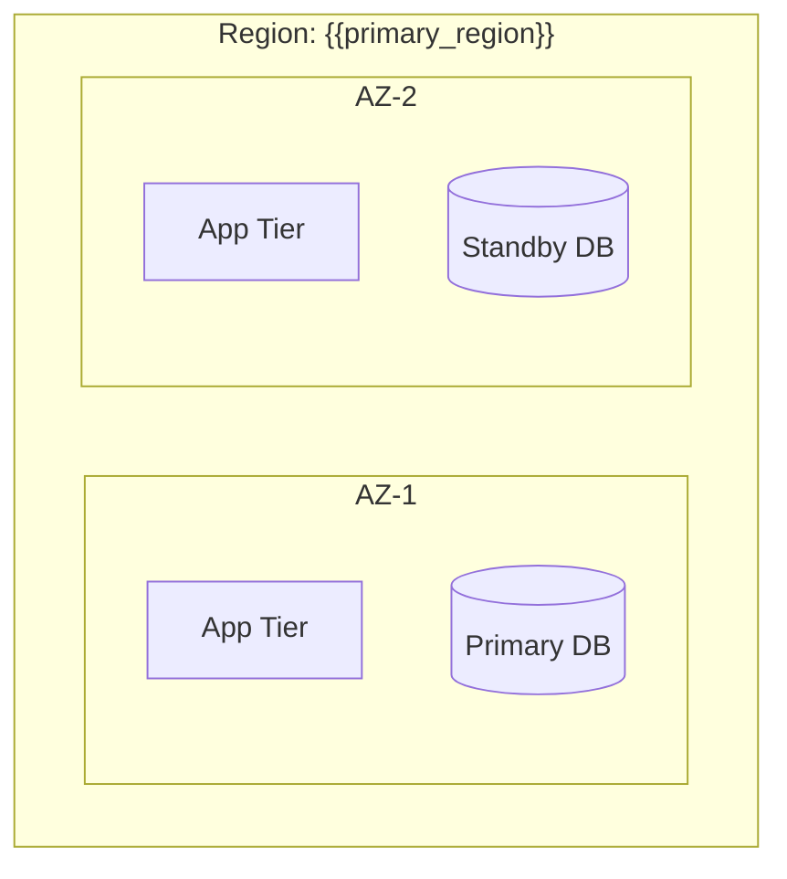
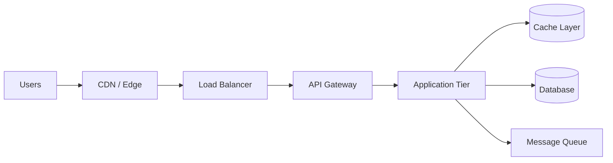
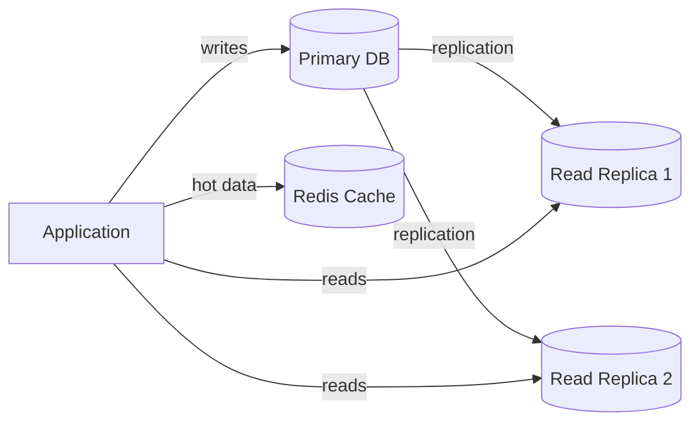
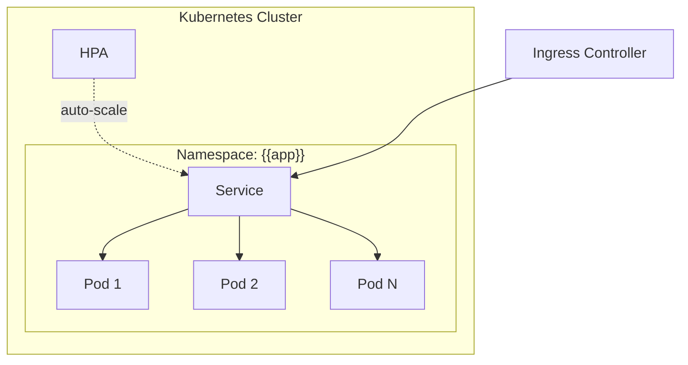
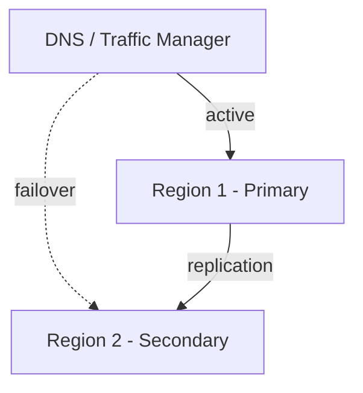

### Output Template

Fill in this template when producing your final output:

~~~markdown
<!-- Generated by spec-lite v0.0.8 | agent: architect | date: {{date}} -->

# Architecture: {{system_name}}

## 1. Overview & Requirements Summary

### System Description
{{What the system does, who it serves, and the key operational requirements}}

### Operational Profile
| Parameter | Value |
|-----------|-------|
| Expected users (launch) | {{value}} |
| Expected users (12 months) | {{value}} |
| Peak concurrent users | {{value}} |
| Geographic distribution | {{value}} |
| Availability SLA | {{value}} |
| Latency requirements | {{value}} |
| Compliance | {{value}} |
| Cloud provider | {{value}} |

---

## 2. Application Architecture Strategy

### Topology Decision
| Dimension | Recommendation | Rationale |
|-----------|---------------|-----------|
| App shape | `{{monolith / modular monolith / microservices}}` | {{why based on team size and domain complexity}} |
| Repo structure | `{{monorepo / polyrepo / hybrid}}` | {{why}} |
| Tooling | `{{Nx / Turborepo / Gradle / none}}` | {{if applicable}} |

### Bounded Domains & Split Candidates
{{For microservices: list which services exist, their ownership, and why each warrants separation. For a monolith: describe the internal module structure to keep it decomposable.}}

### Growth Path
{{How does this topology evolve if the team grows or complexity increases? E.g., "Start as a monolith, extract the Notification module when it reaches independent deploy cadence."}}

---

## 3. Cloud Provider & Region Strategy

### Region Selection
{{Which regions and why — proximity to users, compliance requirements, service availability, paired regions for DR}}

### Availability Zone Strategy
{{How AZs are used for high availability — multi-AZ deployments, zone-redundant services}}

---

## 4. Network & Infrastructure Topology

### Network Design
{{VPC/VNet layout, subnets, CIDR ranges, peering, NAT gateways}}

### Request Flow
{{DNS → CDN → Load Balancer → API Gateway → App Tier → Data Tier}}

---

## 5. Database & Storage Strategy

### Data Model Reference
> Source: `.spec-lite/data_model.md` (if exists). Summarise the key schema facts that drive infrastructure decisions.

| Fact | Value |
|------|-------|
| Target RDBMS | {{e.g., PostgreSQL 16}} |
| Approximate table count | {{n}} |
| Largest expected tables | {{table names + rough row counts}} |
| Soft-delete used | {{yes / no}} |
| Key indexes noted | {{describe any non-trivial indexes}} |

### Primary Database
{{Database choice, justification tied to access patterns, configuration}}

### Why This Database
{{Honest discussion of trade-offs — why this fits, what alternatives were considered, what would change the recommendation}}

### Read/Write Strategy
{{Read replicas, connection pooling, write routing — if applicable}}

### Caching Strategy
{{What is cached, cache invalidation approach, TTLs, cache-aside vs write-through}}

### Backup & Disaster Recovery
{{Automated backups, point-in-time recovery, cross-region replication}}

---

## 6. Container & Orchestration Architecture

> Skip this section if containerization is not warranted for this system.

### Container Strategy
{{Docker image approach, registry, multi-stage builds}}

### Orchestration
{{Kubernetes (EKS/AKS/GKE), serverless containers (Fargate/Container Apps/Cloud Run), or simpler deployment}}

### Pod Topology & Scaling
{{Namespaces, deployments, replica counts, HPA configuration, node pools}}

---

## 7. Caching & CDN Strategy

### CDN Configuration
{{What is served via CDN, cache rules, origin configuration}}

### Distributed Caching
{{Redis/Memcached topology, cluster mode, eviction policies}}

### Cache Invalidation
{{Strategy for keeping cache consistent — TTL-based, event-driven, versioned keys}}

---

## 8. Scaling & Reliability

### Scaling Strategy
{{Horizontal vs vertical, auto-scaling triggers and thresholds}}

### API Resilience Patterns

| Pattern | Configuration | Library / Service |
|---------|--------------|-------------------|
| Retry + exponential backoff + jitter | `base=100ms, max=10s, maxRetries=5, jitter=±20%` | {{e.g., Polly, Resilience4j, AWS SDK built-in, Axios-retry}} |
| Circuit breaker | `failureThreshold=50%, timeout=30s, halfOpenProbes=3` | {{e.g., Polly, Resilience4j, Istio, Hystrix}} |
| Idempotency keys | {{Which endpoints. Storage: DB column / Redis with TTL}} | {{framework/custom}} |
| Timeout policy | `read=5s, write=15s, downstream=3s` | {{framework/custom}} |

### Server-Side Response Caching

| Layer | What Is Cached | TTL / Invalidation | Implementation |
|-------|---------------|-------------------|----------------|
| CDN/edge | {{static assets, public API responses}} | {{TTL + cache-bust on deploy}} | {{CloudFront / Azure CDN / Cloud CDN rules}} |
| HTTP headers | {{publicly cacheable GET endpoints}} | `Cache-Control: max-age={{n}}` + `ETag` | {{web framework middleware}} |
| Application cache | {{expensive query results, computed aggregates}} | `TTL={{n}}s`, evict on write | {{Redis + framework decorator}} |

### Client-Side Caching Strategy
_(Complete this section only for UI-bearing systems)_

| Mechanism | Used For | Notes |
|-----------|----------|-------|
| `localStorage` | {{non-sensitive user prefs, last-viewed items}} | Never store auth tokens here |
| `sessionStorage` | {{transient UI state}} | Cleared on tab close |
| SWR / React Query / TanStack Query | {{API data with stale-while-revalidate}} | `staleTime={{n}}ms, gcTime={{n}}ms` |
| Service Worker + Cache API | {{offline support, asset caching}} | Workbox recommended |
| HTTP `Cache-Control` on assets | {{JS/CSS bundles, images}} | Content-hash filenames for automatic bust |

### Distributed System Reliability

| Pattern | Applied To | Notes |
|---------|-----------|-------|
| Outbox pattern | {{async event publishing}} | Prevents dual-write, guarantees delivery |
| Saga (choreography/orchestration) | {{multi-step distributed transactions}} | {{which flows}} |
| Dead-letter queue | {{all async consumers}} | Alerts on DLQ depth |
| Graceful shutdown | {{all services}} | Drain in-flight requests before SIGTERM |
| Health checks | {{liveness + readiness}} | Separate probes; readiness gates traffic |

### Failover Strategy
{{Active-active vs active-passive, DNS failover, data replication lag management}}

---

## 9. Security & Compliance

### Network Security
{{Network segmentation, WAF, DDoS protection, private endpoints}}

### Data Security
{{Encryption at rest, encryption in transit, key management}}

### Identity & Access
{{IAM policies, service accounts, RBAC, workload identity}}

### Secrets Management
{{How secrets are stored and rotated — Secrets Manager, Key Vault, etc.}}

### Compliance Controls
{{Specific controls for regulatory requirements — GDPR, PCI-DSS, HIPAA, SOC 2}}

---

## 10. Cost Estimation Guidelines

> This is not a precise cost estimate — it's a directional guide to help plan budgets.

| Component | Service | Estimated Monthly Cost Range | Notes |
|-----------|---------|------------------------------|-------|
| {{component}} | {{service}} | {{range}} | {{notes}} |

### Cost Optimization Recommendations
{{Reserved instances, spot instances, right-sizing, auto-scaling to zero, etc.}}

---

## 11. Cloud Resource Best Practices

> Actionable recommendations to get maximum value from your cloud resources. Tailor to the specific provider and services selected above.

### Compute
- {{e.g., Use Spot/Preemptible instances for fault-tolerant batch workloads to reduce cost by up to 90%}}
- {{e.g., Enable auto-scaling with both scale-out and scale-in policies; avoid only scaling out}}
- {{e.g., Right-size instances using provider cost explorer tools after 2 weeks of production traffic}}

### Database
- {{e.g., Enable connection pooling (PgBouncer / RDS Proxy / Azure SQL connection pooler) to prevent connection exhaustion under load}}
- {{e.g., Use read replicas for reporting queries to avoid impacting the write path}}
- {{e.g., Schedule automated backups during low-traffic windows; test restores quarterly}}

### Networking & CDN
- {{e.g., Route static assets exclusively through CDN — never from the origin app server}}
- {{e.g., Enable HTTP/2 or HTTP/3 on load balancers and CDN edges for multiplexing}}
- {{e.g., Use private endpoints/VPC peering for service-to-service communication to avoid egress charges}}

### Observability
- {{e.g., Set up structured logging with correlation IDs across all services}}
- {{e.g., Define SLIs/SLOs before going to production; instrument them from day one}}
- {{e.g., Alert on DLQ depth, circuit breaker trips, and P99 latency, not just error rates}}

### Security Hygiene
- {{e.g., Rotate secrets automatically using provider-native rotation (Secrets Manager / Key Vault)}}
- {{e.g., Enforce MFA on all human IAM principals; use workload identity for service-to-service auth}}
- {{e.g., Enable provider-level threat detection (GuardDuty / Defender for Cloud / Security Command Center)}}

---

## 12. Decisions Log

| # | Decision | Chosen | Alternatives Considered | Rationale |
|---|----------|--------|------------------------|-----------|
| 1 | {{decision}} | {{chosen}} | {{alternatives}} | {{why}} |
| 2 | {{decision}} | {{chosen}} | {{alternatives}} | {{why}} |

~~~
