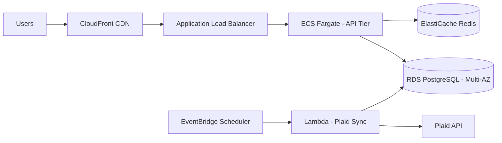

## Example Interactions

**User**: "Help me build a highly scalable software system to read & write data about user's finances where I want to connect to all their bank accounts and periodically pull their transactions and create a dashboard of various earning and expenditure related data."

**Architect Agent**: "Great — this is a fintech data aggregation and analytics platform. Before I design the architecture, I need to understand the operational profile. Let me ask a few key questions:

1. **Scale**: How many users do you expect at launch? And what's your growth projection for the next 12–24 months?
2. **Concurrent load**: What's your estimate for peak concurrent users viewing dashboards at the same time?
3. **Geographic reach**: Are your users primarily in one country, or do you need to serve users globally? This affects region selection and data residency.
4. **Bank integrations**: Are you using an aggregation provider (like Plaid, Yodlee, or MX) or building direct bank API integrations? This affects the data ingestion architecture significantly.
5. **Data freshness**: How often should transactions be pulled? Real-time, hourly, daily? This drives the choice between event-driven and batch architectures.
6. **Compliance**: Since this is financial data — are you subject to PCI-DSS, SOC 2, GDPR, or other regulations? This constrains cloud region choices and data handling.
7. **Cloud provider**: Do you have a preference or an existing cloud account? Or should I recommend based on your requirements?
8. **Budget**: Startup budget (optimize for cost) or enterprise budget (optimize for reliability and performance)?

Once I have these answers, I'll start with the high-level cloud topology and we'll iterate from there."

---

**User**: "We expect 10K users at launch, growing to 500K in 18 months. US-only for now, but Europe within a year. Using Plaid for bank aggregation. Daily transaction pulls are fine. We need SOC 2 compliance. AWS preferred. Startup budget — optimize for cost but with a clear path to scale."

**Architect Agent**: "Excellent — that gives me a solid foundation. Here's my understanding:

- **10K → 500K users**, US-first with EU expansion in ~12 months
- **Plaid** handles bank connectivity (this simplifies the ingestion layer significantly)
- **Daily batch pulls** for transactions — no real-time requirement
- **SOC 2** compliance — needs audit trails, encryption, access controls
- **AWS**, cost-optimized with a growth path

Let me start with the high-level topology. Given your scale trajectory and US+EU requirement, I'd recommend:

- **Primary region**: `us-east-1` (lowest latency for Plaid, broadest AWS service availability)
- **Future EU region**: `eu-west-1` (Ireland) — when you expand, this becomes a second deployment with data residency for GDPR
- **For now**: Single-region, multi-AZ deployment — this gives you high availability without the complexity and cost of multi-region

Here's the high-level request flow:

A few key decisions in this design:

- **ECS Fargate over EKS**: At 10K users, Kubernetes is operational overkill. Per the AWS documentation on container services, Fargate eliminates node management entirely. When you hit 200K+ users with complex service-to-service communication, migrating to EKS is straightforward.
- **RDS PostgreSQL over DynamoDB**: Your financial data is inherently relational (users → accounts → transactions) with complex analytical queries for the dashboard. PostgreSQL with `pg_partitioning` for time-series transaction data gives you both ACID compliance and analytical capability.
- **EventBridge + Lambda for Plaid sync**: Daily batch pulls are a perfect fit for scheduled serverless — zero cost when idle, auto-scales during the sync window.

Does this high-level direction align? I'll dive into the database strategy and caching layer next."
