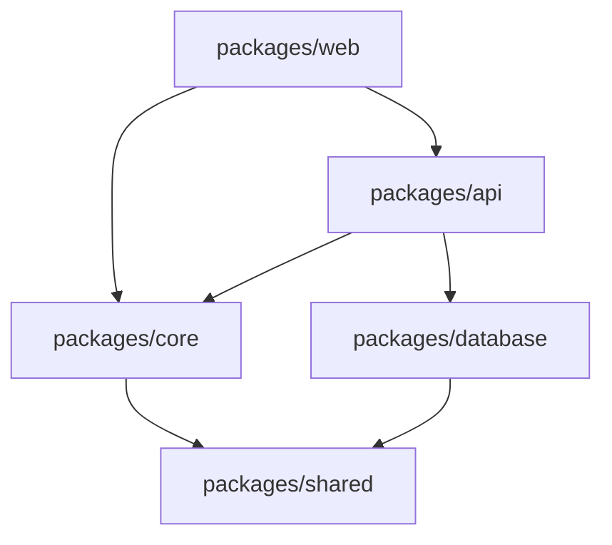

## Output: Per-Project Docs + Index + `README.md`

### Output 1: `docs/explore/<project-name>.md` (one per project/package)

Each project/package gets a dedicated documentation file. The filename should be the project/package name in kebab-case (e.g., `api-service.md`, `shared-core.md`, `web-frontend.md`).

**Section applicability rule**: Include only sections that are supported by evidence and meaningful for the project. Omit sections that do not apply. In particular:
- Omit `Data Model` when there is no meaningful persistent data model, schema, or entity layer.
- Do not add a test coverage section.
- Do not add an improvement or recommendations section.

```markdown
<!-- Generated by spec-lite v0.0.8 | agent: explore | project: {{project_name}} | date: {{date}} -->

# {{project_name}}

> {{One-line description: what this project/package is and its role in the larger system.}}

## Project Overview 🔍

| Property | Value |
|----------|-------|
| **Path** | {{relative path from repo root, e.g., `packages/api`}} |
| **Project Type** | {{e.g., Web API, CLI tool, shared library, frontend app}} |
| **Role in System** | {{e.g., "Main backend API — serves the frontend and orchestrates domain logic"}} |
| **Primary Language** | {{e.g., TypeScript, C#, Python}} |
| **Framework** | {{e.g., Express, ASP.NET Core, Django}} |
| **Package Manager** | {{e.g., npm, NuGet, pip}} |
| **Build Tool** | {{e.g., tsup, MSBuild, webpack}} |
| **Test Runner (if detected)** | {{e.g., Jest, xUnit, pytest}} |

### Dependencies on Sibling Projects

| Project | What It Provides | Import Examples |
|---------|-----------------|-----------------|
| {{e.g., `packages/core`}} | {{e.g., domain types, business logic services}} | {{e.g., `import { UserService } from '@myapp/core'`}} |

## Tech Stack 🔍

### Key Dependencies

| Dependency | Version | Purpose |
|------------|---------|---------|
| {{name}} | {{version}} | {{what it's used for}} |

## Architecture 🔍

### Architectural Pattern

{{Identified pattern within this project: MVC, Clean Architecture, Layered, etc.}}

### Internal Structure

```
{{Directory tree of this project, annotated with component roles}}
```

### Component Diagram

```
{{ASCII or Mermaid diagram showing this project's internal components and their relationships}}
```

### Component Descriptions

| Component | Responsibility | Key Files |
|-----------|---------------|-----------|
| {{name}} | {{what it does}} | {{path/to/main/files}} |

### Primary Request Flow

{{Trace of the most representative use case through this project, from entry to response.}}

## Data Model 🔍

### Entities / Models

| Entity | Key Fields | Relationships | Storage |
|--------|------------|---------------|---------|
| {{name}} | {{primary fields}} | {{e.g., has-many Orders}} | {{e.g., PostgreSQL, in-memory}} |

### Data Access Pattern

{{e.g., Repository pattern via TypeORM, Active Record via Django ORM, raw SQL}}

### Entity Relationship Diagram

```
{{ASCII or Mermaid ER diagram if applicable}}
```

## Business Features 🔍

> What does this project do from a user/business perspective?

| Domain | Features | Key Endpoints / Commands | Key Files |
|--------|----------|--------------------------|-----------|
| {{e.g., User Management}} | {{e.g., Registration, Login, Profile}} | {{e.g., POST /api/users, GET /api/users/:id}} | {{e.g., src/users/}} |

### Primary Use Cases

1. {{e.g., User registers an account → validates email/password → creates User entity → sends welcome email}}
2. {{e.g., User places an order → validates inventory → creates Order → charges payment → sends confirmation}}

## Key Design Patterns 🔍

| Pattern | Where Used | Example |
|---------|-----------|---------|
| {{e.g., Repository Pattern}} | {{e.g., Data access layer}} | {{e.g., `UserRepository`, `OrderRepository`}} |

### Conventions

- {{e.g., Files use kebab-case naming}}
- {{e.g., All services are registered via DI in `startup.ts`}}
- {{e.g., Error responses follow `{ error: { code, message } }` envelope}}

## Decisions Log 🔍

> Observed architectural and design decisions within this project.

| # | Decision | Chosen Approach | Evidence | Trade-offs |
|---|----------|----------------|----------|------------|
| 1 | {{e.g., ORM choice}} | {{e.g., Prisma}} | {{e.g., prisma/ directory}} | {{e.g., Type-safe vs migration complexity}} |
```

---

### Output 2: `docs/explore/INDEX.md` (master index)

This is the **navigational hub** for the entire exploration. It ties all per-project docs together.

```markdown
<!-- Generated by spec-lite v0.0.8 | agent: explore | date: {{date}} -->

# Codebase Exploration Index: {{repo_name}}

> Auto-generated by the spec-lite Explore agent. This document provides a comprehensive overview of the repository and links to detailed per-project documentation.

## Repository Overview

| Property | Value |
|----------|-------|
| **Repository Topology** | {{e.g., Monorepo with workspaces, Multi-project solution, Single project}} |
| **Total Projects/Packages** | {{count}} |
| **Primary Language(s)** | {{e.g., TypeScript, C#}} |
| **Primary Framework(s)** | {{e.g., Next.js, Express, ASP.NET Core}} |
| **Build System** | {{e.g., Nx + pnpm, MSBuild, Gradle}} |
| **CI/CD** | {{e.g., GitHub Actions, Azure Pipelines}} |

## Project Map

### Dependency Graph



### Project Summary

| # | Project | Path | Type | Role | Key Tech | Doc Link |
|---|---------|------|------|------|----------|----------|
| 1 | {{name}} | {{path}} | {{type}} | {{role in system}} | {{framework/key dep}} | [Details]({{project-name}}.md) |
| 2 | {{name}} | {{path}} | {{type}} | {{role in system}} | {{framework/key dep}} | [Details]({{project-name}}.md) |

## Cross-Project Analysis

### Shared Patterns

> Patterns and conventions that are consistent across all (or most) projects.

- {{e.g., All projects use ESLint with the same shared config}}
- {{e.g., Error handling consistently uses custom `AppError` class with error codes}}
- {{e.g., All APIs follow RESTful conventions with `{ data, error, meta }` response envelope}}

### Inconsistencies

> Places where projects diverge in approach as part of the current state.

| Area | Project A | Project B | Evidence |
|------|-----------|-----------|----------|
| {{e.g., Error handling}} | {{e.g., Throws custom exceptions}} | {{e.g., Returns Result<T> types}} | {{e.g., global middleware vs Result wrapper}} |

### Dependency Hotspots

> Shared projects/packages that many other projects depend on — changes here have high blast radius.

| Package | Depended On By | Risk Level | Notes |
|---------|---------------|------------|-------|
| {{e.g., packages/shared}} | {{e.g., All 4 other packages}} | High | {{e.g., Contains core types — breaking changes affect everything}} |

### Integration Points

> How projects communicate with each other and with external systems.

| From | To | Mechanism | Contract |
|------|----|-----------|----------|
| {{e.g., web}} | {{e.g., api}} | {{e.g., REST API / HTTP}} | {{e.g., OpenAPI spec in api/openapi.yaml}} |
| {{e.g., api}} | {{e.g., database}} | {{e.g., Direct import / Prisma client}} | {{e.g., Prisma schema}} |

### Build & Deployment Order

```
{{Correct build order based on dependency graph}}
1. packages/shared       (no dependencies)
2. packages/database     (depends on shared)
3. packages/core         (depends on shared)
4. packages/api          (depends on core, database)
5. packages/web          (depends on core, api types)
```

## Exploration Details

For detailed technical documentation of each project, see:

{{Numbered list with one-paragraph summary and link for each project}}

1. **[{{project-name}}]({{project-name}}.md)** — {{2-3 sentence summary covering what it does, key tech, and notable findings.}}
2. **[{{project-name}}]({{project-name}}.md)** — {{2-3 sentence summary.}}
```

---

### Output 3: `README.md` (repo root)

Follow the conventions from [write_readme.md](write_readme.md). The README should contain:

- **Title + tagline** (1 line — what this project is)
- **What Is This** (2–3 paragraphs — what it does, who it's for, why it exists)
- **Features** (bullet list of key capabilities)
- **Quick Start** (install + first use in <30 seconds)
- **Usage** (detailed examples for primary use cases)
- **Configuration** (table of options/env vars if applicable)
- **Architecture** (brief overview + link to `docs/explore/INDEX.md` for details)
- **Development** (prerequisites, setup, running tests)
- **Contributing** (brief guidelines or link to CONTRIBUTING.md)
- **License** (one line)

> **If a README already exists**: Read it, preserve user-authored sections, update stale information, and add missing sections.
