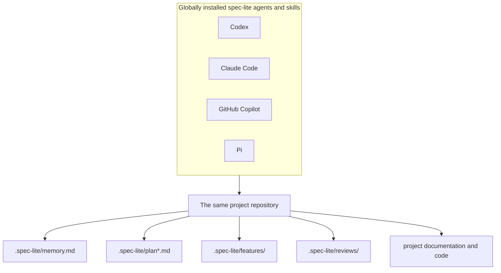

# Architecture

spec-lite separates a **reusable workflow** from **local project state**. The
workflow — agents, skills, and shared contracts — is installed once per machine
and rendered into whatever format each harness expects. The state — plans,
memory, feature specs, changesets, reviews, documentation — stays in the
repository and is committed with the code.



The harness is the interface; the repository is the durable source of truth.
Because every role re-reads the repository rather than a conversation history,
work started in one harness can be continued in another without rebuilding
context.

## Roles

Two kinds of role, both rendered from the same Markdown sources:

| | Agents | Skills |
|---|---|---|
| Shape | Autonomous specialist persona | Focused, repeatable workflow |
| Selection | Chosen explicitly from a picker | Auto-discovered or named |
| Source | `agents/<name>/AGENT.md` | `skills/<name>/SKILL.md` |
| Examples | `spec.planner`, `spec.architect` | `spec-implement`, `spec-review` |

Two shared references back them: `help` is the user-facing catalog, and
`orchestrator` defines the precedence, naming, feature-ID, memory, and handoff
contracts every role obeys. See [Agents and skills](features/agents-and-skills.md).

## Provider adapters

`init` and `install` render the same sources into each harness's expected agent,
command, prompt, skill, and root-instruction formats:

| Provider | Project files | Global agent/skill folders |
|---|---|---|
| GitHub Copilot | `.github/agents/`, `.github/prompts/`, `.github/skills/`, `.github/copilot-instructions.md` | `~/.copilot/agents/`, `~/.copilot/prompts/`, `~/.copilot/skills/` |
| Claude Code | `.claude/agents/`, `.claude/commands/`, `CLAUDE.md` | `~/.claude/agents/`, `~/.claude/commands/` |
| OpenAI Codex | `.codex/agents/`, `.agents/skills/`, `AGENTS.md` | `~/.codex/agents/`, `~/.agents/skills/`, `~/.codex/AGENTS.md` |
| Pi | `.pi/prompts/`, `.pi/skills/` | `~/.pi/agent/prompts/`, `~/.pi/agent/skills/` |
| Generic | `.spec-lite/prompts/` for copy/paste into any LLM | Not supported; use `export` for a portable bundle |

Global installation state is recorded at `~/.spec-lite/global-config.json`;
project state stays in the repository.

`update` owns generated provider outputs and only the spec-lite marker blocks
inside shared instruction files such as `AGENTS.md` and `CLAUDE.md`. Unrelated
user content in those files is retained.

## Project state

```text
.spec-lite/
├── memory.md                  Standing project conventions
├── brainstorm.md              Product discovery context
├── plan.md                    Default technical blueprint
├── plan_<name>.md             Optional named blueprint
├── hooks.json                 Project hook registry
├── features/
│   ├── FEAT-###-<name>/       One directory per feature
│   │   ├── spec.md            The feature spec
│   │   ├── changeset.json     Hook-captured file changes — the review scope
│   │   └── hooks.log.jsonl    Append-only audit of every hook run
│   ├── unit_tests_<name>.md
│   └── integration_tests_<name>.md
├── reviews/                   Plan and implementation reviews
├── stacks/                    Selected stack baselines
├── data_model.md              Relational model, when used
├── TODO.md                    Deferred enhancement backlog
├── yolo_state.md              Resumable autonomous-run state
└── tools/                     Project-specific context helpers
```

`FEAT-###` identifiers are allocated once (highest existing number plus one) and
never renumbered, so plans, feature specs, implementation, tests, reviews, and
hook payloads all refer to the same feature by the same name.

Commit these files with the related code. That makes decisions reviewable in pull
requests and lets another developer — or a different harness — continue with the
same state. See [Memory and project state](features/memory.md).

## Lifecycle events

Roles announce their lifecycle points as versioned events (`implement.pre`,
`review.verdict`, `fix.post`, …) by running `spec-lite hook run <event>`. That is
the extension seam: anything subscribed in the hook registry runs at that point,
whether it is shipped with the CLI or written by you.

Two builtins subscribe by default and capture each feature's `changeset.json`,
which Review then uses as its authoritative file scope. Everything about that is
replaceable. See [Hooks](features/hooks.md).

## Configuration

`.spec-lite.json` records the format/version, selected providers, installed
sources, timestamps, the optional project profile, and documentation settings:

```json
{
  "version": "0.3.1",
  "format": "v2",
  "provider": "codex",
  "providers": ["codex", "claude-code"],
  "installedPrompts": ["brainstorm", "plan", "feature", "implement", "review"],
  "installedAt": "2026-08-15T12:00:00.000Z",
  "updatedAt": "2026-08-15T12:00:00.000Z",
  "documentation": {
    "directory": "docs",
    "level": "technical",
    "updateWithDevelopment": true
  }
}
```

| Key | Meaning |
|---|---|
| `format`, `version` | Config format and the CLI version that wrote it |
| `provider`, `providers` | The configured harnesses; `provider` is the primary one |
| `installedPrompts` | Source names installed into this project |
| `documentation` | Output directory, depth, and whether Implement/Fix update docs — see [Documentation](features/documentation.md) |
| `hooks.enabled` | Set to `false` to silence every hook in this clone — see [Hooks](features/hooks.md#turning-hooks-off) |

## Repository layout of spec-lite itself

```text
agents/       Strategic autonomous roles
skills/       Reusable task workflows and local references/assets
references/   Shared help and orchestration contracts
schema/       JSON Schema for .spec-lite/hooks.json
scripts/      Generators for the schema and the hook doc tables
src/          TypeScript CLI, providers, hooks, stack baselines, utilities
test/         Catalog, handoff, link, detection, upgrade, export, hook, and stack tests
docs/         This documentation set
```

Generated artifacts have a single source of truth in `src/`, and tests fail if
the committed copies drift: `schema/hooks.schema.json` is generated from
`src/hooks/schema.ts`, and the variable and event tables in
[`docs/features/hooks.md`](features/hooks.md) are generated from
`src/hooks/interpolation.ts` and `src/hooks/events.ts`.
