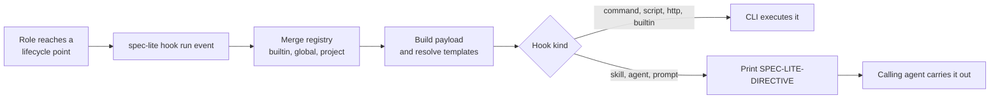

# Hooks

Hooks are spec-lite's general extension mechanism. Every core role announces its
lifecycle points as versioned **events** — `implement.pre`, `review.verdict`,
`fix.post`, and so on — and a hook is anything you subscribe to one of them.
What the hook does is entirely yours: run a linter, call a webhook, write a file,
or tell the calling agent to invoke another skill.

Changeset capture — the `changeset.json` that Review uses as its file scope — is
**not** the hook system. It is two ordinary hooks that happen to ship enabled by
default, written against the same public contract as anything you add, and you
can disable, replace, or ignore them without affecting any other hook.

- [Concepts](#concepts)
- [The two kinds of hook](#the-two-kinds-of-hook)
- [Add a hook](#add-a-hook)
- [Inspect hooks](#inspect-hooks)
- [Change or delete a hook](#change-or-delete-a-hook)
- [More examples](#more-examples)
- [Built-in hooks](#built-in-hooks)
- [Hook definition reference](#hook-definition-reference)
- [Interpolation](#interpolation)
- [Event catalog](#event-catalog)
- [Failure handling and exit codes](#failure-handling-and-exit-codes)
- [Audit log](#audit-log)
- [Turning hooks off](#turning-hooks-off)
- [Troubleshooting](#troubleshooting)

## Concepts

| Term | Meaning |
|---|---|
| **Event** | A named lifecycle point, dotted and hierarchical (`implement.task.post`). A role reaches the point and runs `spec-lite hook run <event>`. |
| **Hook** | One entry in the registry that subscribes to one or more events and says what to do. |
| **Registry** | The merged set of hooks: builtins, then `~/.spec-lite/hooks.json`, then `.spec-lite/hooks.json`. |
| **Payload** | The JSON describing one event occurrence. Reachable from every hook through `${...}` templates, and delivered to `command`/`script` hooks on stdin and as `SPEC_LITE_*` environment variables. |
| **Directive** | The `SPEC-LITE-DIRECTIVE` line an agentic hook prints for the calling role to carry out. |



Hooks are dispatched in `order` (ascending, default `100`), ties broken by
declaration order. A hook subscribed to a wildcard such as `implement.*` fires on
every matching event; `*` matches one or more whole dotted segments.

## The two kinds of hook

| Kind | `type` | Who runs it | Guarantee |
|---|---|---|---|
| **Deterministic** | `command`, `script`, `http`, `builtin` | The CLI itself, with a timeout, an exit code, and a failure policy | Ran, or reported a failure |
| **Agentic** | `skill`, `agent`, `prompt` | Nobody — the CLI prints a `SPEC-LITE-DIRECTIVE` line and the calling agent acts on it | Best effort, by design |

The split is deliberate. Anything that must happen — a formatter, a webhook, a
guard that blocks the run — belongs in a deterministic kind. Anything that needs
judgement (*"review this deeply"*, *"record that decision in memory"*) belongs in
an agentic kind, where a model does the work and the CLI never pretends to
control the outcome.

## Add a hook

The worked example: **run the linter after each implementation, and stop the run
if it fails.**

### 1. Write the registry entry

Hooks live in `.spec-lite/hooks.json`. Create it if it does not exist:

```json
{
  "version": 1,
  "hooks": [
    {
      "name": "lint-after-implement",
      "description": "Run the linter after implementation; block on failure.",
      "events": ["implement.post"],
      "type": "command",
      "run": "npm run lint",
      "onFailure": "abort",
      "timeoutMs": 120000
    }
  ]
}
```

`name` is the identity of the hook — the merge key across registry layers, the
argument to `hook test`, and what appears in the audit log. `version` is the
registry format version and is always `1`.

> The file accepts only `version` and `hooks`; a `$schema` key is rejected. For
> editor autocomplete, point your editor at the published
> [`schema/hooks.schema.json`](../../schema/hooks.schema.json) instead.

### 2. Validate it

```bash
spec-lite hook validate
```

```text
Registry valid. 0 warning(s).
```

Validation is a static check with no side effects: JSON schema, event names, and
every `${...}` template against the variables its events guarantee. Run it in CI
so a broken registry fails the build rather than a delivery run.

### 3. Test it in isolation

`hook test` fires one hook against a synthetic payload without waiting for a role
to reach the real lifecycle point. It runs the actual executor — a `command` hook
really executes:

```bash
spec-lite hook test lint-after-implement --feature FEAT-012
```

```text
Testing "lint-after-implement" against event implement.post

  ✓ lint-after-implement (command) [ok]
```

### 4. Preview a whole event

`--dry-run` resolves every subscribed hook and prints what *would* run, with any
`${env:...}` value redacted:

```bash
spec-lite hook run implement.post --feature FEAT-012 --dry-run
```

```text
  − capture-changeset (builtin) [skipped] — dry run — not executed
    builtin:capture-changeset
  − lint-after-implement (command) [skipped] — dry run — not executed
    npm run lint
```

### 5. Let it fire

Nothing else to wire up. The next time Implement finishes a feature it runs the
event itself, and the hook goes with it:

```text
  ✓ capture-changeset (builtin) [ok] — 2 file(s) in changeset (2 excluded)
  ✓ lint-after-implement (command) [ok]
```

## Inspect hooks

| Command | Answers |
|---|---|
| `spec-lite hook list` | Which hooks are active, which layer defined them, what they subscribe to |
| `spec-lite hook list --event implement.post` | Which hooks would fire for one specific event |
| `spec-lite hook events` | The full event catalog with `emitted`/`planned` status |
| `spec-lite hook vars` | Every `${...}` variable, its group, and an example value |
| `spec-lite hook validate` | Whether the merged registry is correct |
| `spec-lite hook test <name>` | What one hook actually does |

```bash
spec-lite hook list
```

```text
capture-baseline (builtin) — builtin — enabled
  events: implement.pre, implement.task.pre, fix.pre
  Records HEAD and pre-existing dirt so later diffs are scoped to this run.
capture-changeset (builtin) — builtin — enabled
  events: implement.post, implement.task.post, fix.post
  Diffs against the captured baseline and merges the result into changeset.json.
lint-after-implement (project) — command — enabled
  events: implement.post
  Run the linter after implementation; block on failure.
```

The parenthesised word is provenance: `builtin`, `global`
(`~/.spec-lite/hooks.json`), or `project` (`.spec-lite/hooks.json`). Later layers
replace earlier ones **by name**, wholesale — not a deep merge — so naming your
hook after a builtin replaces that builtin outright.

`hook list` shows only active hooks. A hook set to `enabled: false` disappears
from the listing rather than appearing as disabled.

## Change or delete a hook

| Goal | Do this |
|---|---|
| Delete a hook you added | Remove its object from `.spec-lite/hooks.json` |
| Keep it but stop it firing | Set `"enabled": false` on the entry |
| Turn off a builtin | Add an entry with the builtin's `name` and `"enabled": false` |
| Replace a builtin's behavior | Add an entry reusing the builtin's `name` with your own `type` and body |
| Change it for one repository only | Edit `.spec-lite/hooks.json`; it wins over the global file |
| Silence everything, everywhere | `"hooks": { "enabled": false }` in `.spec-lite.json` |

Deleting the linter hook is exactly what it sounds like — drop the object, then
confirm it is gone:

```bash
spec-lite hook list --event implement.post
```

Turning off a shipped builtin without redefining it:

```json
{
  "version": 1,
  "hooks": [
    { "name": "capture-changeset", "events": ["implement.post"], "type": "builtin", "enabled": false }
  ]
}
```

After that, `spec-lite hook list` no longer shows `capture-changeset` and
`implement.post` dispatches only your own hooks. Review then has no
`changeset.json` for that feature and falls back to the spec's `Touched Files`
list — see [Built-in hooks](#built-in-hooks).

Replacing a builtin instead of disabling it — same name, different body:

```json
{
  "version": 1,
  "hooks": [
    {
      "name": "capture-changeset",
      "events": ["implement.post"],
      "type": "command",
      "run": "node scripts/my-changeset.mjs ${feature.dir}"
    }
  ]
}
```

## More examples

### Notify Slack when a review requests changes

Secrets never belong in a committed registry. `${env:NAME}` is the only channel
for them, and its value is redacted from `--dry-run` output and the audit log:

```json
{
  "name": "slack-review-verdict",
  "events": ["review.verdict"],
  "type": "http",
  "url": "${env:SLACK_WEBHOOK_URL}",
  "bodyTemplate": "{\"text\":\"Review verdict: ${verdict} — ${summary}\"}",
  "onFailure": "warn"
}
```

### Hand off to another skill automatically

An agentic hook does not run anything; it tells the calling agent what to do next:

```json
{
  "name": "review-after-implement",
  "events": ["implement.post"],
  "type": "skill",
  "skill": "spec-review",
  "args": "review feature ${feature.name}"
}
```

```text
  ✓ review-after-implement (skill) [emitted]
    SPEC-LITE-DIRECTIVE {"hook":"review-after-implement","type":"skill","event":"implement.post","skill":"spec-review","args":"review feature user_management"}
```

### Stamp every completed task into a log

Substituted values are escaped for wherever they land, so a feature name
containing a quote cannot break out of the command:

```json
{
  "name": "task-log",
  "events": ["implement.task.post"],
  "type": "command",
  "run": "echo ${timestamp} ${feature.id} ${task.id} >> .work-log",
  "order": 200
}
```

### Route hook failures somewhere visible

`hook.error` fires after any hook fails, with a `${summary}` naming the failures.
It never recurses into itself:

```json
{
  "name": "hook-failures-to-slack",
  "events": ["hook.error"],
  "type": "http",
  "url": "${env:SLACK_WEBHOOK_URL}",
  "bodyTemplate": "{\"text\":\"spec-lite hook failure: ${summary}\"}"
}
```

## Built-in hooks

Three builtins ship with the CLI. They are ordinary hooks — same registry, same
fields, same failure policy — that exist because file-scope capture is worth
getting right by default:

| Name | Events | Enabled | Does |
|---|---|---|---|
| `capture-baseline` | `implement.pre`, `implement.task.pre`, `fix.pre` | yes | Records HEAD and whatever is already dirty, so pre-existing edits are never attributed to this run |
| `capture-changeset` | `implement.post`, `implement.task.post`, `fix.post` | yes | Diffs against that baseline and merges the result into the feature's `changeset.json` |
| `changeset-from-pr` | — | no (opt-in) | Uses `gh pr diff --name-only` instead of a local git baseline, for PR-first teams |

Builtins run in-process as native TypeScript — no subprocess, no shell, and no
dependency on `spec-lite` being on `PATH`.

`changeset-from-pr` ships but subscribes to nothing until you opt in. Name it
through the `builtin` field and choose the events yourself:

```json
{
  "name": "changeset-from-pr",
  "events": ["implement.post"],
  "type": "builtin",
  "builtin": "changeset-from-pr"
}
```

It is an alternative capture strategy, not an addition: it merges into the same
`changeset.json`, so disable `capture-changeset` alongside it unless you really
want both sources unioned. It requires `gh` on `PATH` and an open pull request
for the current branch.

### What they produce

`.spec-lite/features/FEAT-###-<name>/changeset.json`:

```json
{
  "vcs": "git",
  "featureId": "FEAT-012",
  "baseline": {
    "sha": "bc8bd13cb251b7e397cda10b561d2ed7611859a9",
    "capturedAt": "2026-08-21T14:03:11.204Z",
    "dirtyAtBaseline": []
  },
  "captures": [{ "event": "implement.post", "at": "2026-08-21T14:31:02.028Z", "head": "bc8bd13" }],
  "files": [
    { "path": "src/auth/session.ts", "status": "M", "role": "implement" },
    { "path": "src/auth/expiry.ts", "status": "U", "role": "implement" }
  ],
  "excluded": [".spec-lite/features/FEAT-012-user_management/changeset.json"]
}
```

This is a **baseline-anchored diff, not git history**: it is scoped to exactly
the work done since the `*.pre` event, which is what a hand-maintained
`Touched Files` list was always trying to approximate. Review reads it as the
authoritative scope for `review feature` and `review plan`, falling back to a
spec's `Touched Files` section only for features created before hooks existed.

Generated output is filtered out automatically: `dist/`, `build/`, `out/`,
`node_modules/`, `package-lock.json`, `yarn.lock`, `pnpm-lock.yaml`, and
`.spec-lite/` itself.

### When they do nothing

- **No `--feature`.** Capture is skipped with a note rather than failing — an
  ad-hoc Fix with no tracked feature is a normal case, not an error.
- **Not a git repository.** Capture is disabled and reported; Review falls back
  to the manual list.

To use hooks without changeset capture at all, disable both builtins as shown in
[Change or delete a hook](#change-or-delete-a-hook). Every other hook keeps
working.

## Hook definition reference

| Field | Applies to | Default | Meaning |
|---|---|---|---|
| `name` | all | — | **Required.** Unique identity and merge key across registry layers |
| `events` | all | — | **Required.** Event names or wildcard patterns (`implement.*`) |
| `type` | all | — | **Required.** `command`, `script`, `http`, `builtin`, `skill`, `agent`, `prompt` |
| `description` | all | — | Human-readable note, shown by `hook list` |
| `enabled` | all | `true` | `false` removes the hook from the resolved registry |
| `order` | all | `100` | Lower runs first; ties broken by declaration order |
| `timeoutMs` | deterministic | `30000` | Wall-clock budget before the hook is killed and reported as failed |
| `onFailure` | all | `warn` | `warn` (log and continue), `abort` (stop the chain, exit 1), `ignore` (silent) |
| `once` | all | `false` | Skip if this hook already succeeded for this event on this feature |
| `payloadSchema` | all | — | JSON Schema checked against the payload *before* invocation |
| `builtin` | `builtin` | the hook's `name` | Handler id in the builtin registry |
| `run` | `command`, `script` | — | Command line or script path. Interpolated |
| `shell` | `command`, `script` | `auto` | `auto` (sh on POSIX, PowerShell on Windows), `bash`, `pwsh` |
| `cwd` | `command`, `script` | workspace root | Working directory, relative to the workspace root. Interpolated |
| `env` | `command`, `script` | — | Extra environment variables. Values are interpolated |
| `url` | `http` | — | Target URL. Interpolated and percent-encoded |
| `method` | `http` | `POST` | HTTP method |
| `headers` | `http` | `Content-Type: application/json` | Extra request headers. Values are interpolated and stripped of newlines |
| `bodyTemplate` | `http` | full payload JSON | Request body. Interpolated and JSON-escaped |
| `skill` / `agent` | `skill`, `agent` | — | Name carried in the emitted directive |
| `prompt` | `prompt` | — | Literal instruction carried in the directive. Interpolated |
| `args` | `skill`, `agent` | — | Arguments carried in the directive. Interpolated |

`command` and `script` behave identically; the distinction records intent — a
`script` hook usually names a checked-in file, a `command` hook is a one-liner.
`cmd.exe` is deliberately unsupported: its quoting rules cannot be applied safely,
and safe interpolation depends on correct quoting.

`command` and `script` hooks also receive the payload on **stdin** and through
these environment variables, which is often easier than templating:
`SPEC_LITE_EVENT`, `SPEC_LITE_FEATURE_ID`, `SPEC_LITE_FEATURE_DIR`,
`SPEC_LITE_CHANGED_FILES`, and `SPEC_LITE_PAYLOAD_FILE`.

## Interpolation

`${...}` templates in `run`, `cwd`, `env`, `url`, `headers`, `bodyTemplate`,
`args`, and `prompt` are resolved in a **single pass** — a substituted value is
never re-scanned, so payload text cannot inject further references — then escaped
for its destination:

| Field | Escaping |
|---|---|
| `run` | Shell-quoted, so a value always lands as exactly one argument |
| `url` | Percent-encoded |
| `bodyTemplate` | JSON-escaped, so the body stays parseable |
| `headers` | Newlines collapsed to a space and control characters dropped, so a value cannot inject a second header |
| `cwd`, `env`, `args`, `prompt` | Raw — no shell or wire format is involved |

Resolution **fails closed**. A reference with no value is an error that stops the
hook before it runs; it never becomes an empty string. Write `${task.id:-none}`
wherever a value may legitimately be absent.

```text
${name}                 a table variable
${name:-default}        with a fallback when it has no value
${env:NAME}             a process environment variable
${env:NAME:-default}    with a fallback
$${                     a literal "${"
```

Each event declares which variable **groups** it guarantees, so
`spec-lite hook validate` rejects `${task.id}` on `implement.post` in CI rather
than at fire time:

```text
[error] bad-var: ${task.id} has no guaranteed value on review.post.
        Subscribe to an event that provides "task", or write ${task.id:-default}.
```

`${env:NAME}` reads only the real process environment and is redacted from
`--dry-run` output and `hooks.log.jsonl`. It is the only place a secret belongs —
an `Authorization` header is written as `"Bearer ${env:API_TOKEN}"`, never as the
token itself.

<!-- hook-vars-table:start -->
| Variable | Group | Meaning | Example |
|---|---|---|---|
| `${event}` | base — every event | Full dotted event name. | `implement.post` |
| `${role}` | base — every event | Agent or skill that emitted the event. | `implement` |
| `${phase}` | base — every event | Lifecycle position: pre, post, or signal. | `post` |
| `${runId}` | base — every event | Stable id for one `hook run` invocation. | `01J9F2K7M4` |
| `${timestamp}` | base — every event | ISO-8601 UTC timestamp of the run. | `2026-08-21T14:03:11.204Z` |
| `${cwd}` | base — every event | Absolute workspace root. | `/repo` |
| `${provider}` | base — every event | Configured harness alias, or "unknown". | `claude-code` |
| `${payload}` | base — every event | The entire payload as compact JSON. | `{"event":"implement.post",…}` |
| `${payload.file}` | base — every event | Path to a temp file holding the payload JSON. | `/tmp/spec-lite-x.json` |
| `${feature.id}` | feature | Stable feature identifier. | `FEAT-012` |
| `${feature.name}` | feature | Snake_case feature name. | `user_management` |
| `${feature.dir}` | feature | Feature directory, workspace-relative. | `.spec-lite/features/FEAT-012-user_management` |
| `${feature.spec}` | feature | Feature spec path, workspace-relative. | `.spec-lite/features/FEAT-012-user_management/spec.md` |
| `${task.id}` | task | Task identifier within a feature. | `TASK-003` |
| `${changes.count}` | changes | Number of files in the captured changeset. | `12` |
| `${changes.source}` | changes | How the changeset was captured: git, gh, or none. | `git` |
| `${changes.baseline}` | changes | Baseline commit the changeset is diffed against. | `abc1234` |
| `${changes.head}` | changes | HEAD at capture time. | `def5678` |
| `${changes.files}` | changes | Changed paths, newline-separated. | `src/a.ts\nsrc/b.ts` |
| `${verdict}` | verdict | Review verdict. | `Request changes` |
| `${summary}` | summary | One-line summary supplied by the emitting role. | `Added session expiry handling` |
| `${env:NAME}` | environment | A process environment variable — the only channel for secrets. | `${env:SLACK_WEBHOOK_URL}` |
<!-- hook-vars-table:end -->

`${provider}` reads `provider` (then the first entry of `providers`) from
`.spec-lite.json`, and resolves to `unknown` when neither is configured — so it
never needs a `:-default`.

## Event catalog

Only the core pipeline is wired today. Events marked `planned` are declared so
that subscribing to them validates with a warning rather than an unknown-event
error; they begin firing in a later release.

<!-- hook-events-table:start -->
| Event | Role | Status | Guarantees |
|---|---|---|---|
| `brainstorm.pre` | brainstorm | emitted | — |
| `brainstorm.post` | brainstorm | emitted | `summary` |
| `plan.pre` | plan | emitted | — |
| `plan.post` | plan | emitted | `summary` |
| `plan-feature.pre` | plan-feature | emitted | — |
| `plan-feature.post` | plan-feature | emitted | `feature`, `summary` |
| `architect.pre` | architect | planned | — |
| `architect.post` | architect | planned | `summary` |
| `plan-critic.pre` | plan-critic | planned | — |
| `plan-critic.post` | plan-critic | planned | `summary` |
| `build-data-model.pre` | build-data-model | planned | — |
| `build-data-model.post` | build-data-model | planned | `summary` |
| `feature.pre` | feature | emitted | — |
| `feature.post` | feature | emitted | `summary` |
| `feature.spec.post` | feature | emitted | `feature`, `summary` |
| `implement.pre` | implement | emitted | `feature` |
| `implement.post` | implement | emitted | `feature`, `changes`, `summary` |
| `implement.task.pre` | implement | emitted | `feature`, `task` |
| `implement.task.post` | implement | emitted | `feature`, `task`, `changes` |
| `implement.feature.post` | implement | emitted | `feature`, `changes`, `summary` |
| `review.pre` | review | emitted | — |
| `review.post` | review | emitted | `summary` |
| `review.verdict` | review | emitted | `verdict`, `summary` |
| `fix.pre` | fix | emitted | — |
| `fix.post` | fix | emitted | `changes`, `summary` |
| `write-unit-tests.pre` | write-unit-tests | planned | — |
| `write-unit-tests.post` | write-unit-tests | planned | `summary` |
| `write-integration-tests.pre` | write-integration-tests | planned | — |
| `write-integration-tests.post` | write-integration-tests | planned | `summary` |
| `document.pre` | document | planned | — |
| `document.post` | document | planned | `summary` |
| `document-design.post` | document-design | planned | `summary` |
| `document-feature.post` | document-feature | planned | `feature`, `summary` |
| `document-usage.post` | document-usage | planned | `summary` |
| `document-readme.post` | document-readme | planned | `summary` |
| `devops.pre` | devops | planned | — |
| `devops.post` | devops | planned | `changes`, `summary` |
| `memorize.post` | memorize | planned | `summary` |
| `todo.post` | todo | planned | `summary` |
| `tool-help.post` | tool-help | planned | `summary` |
| `yolo.pre` | yolo | planned | — |
| `yolo.post` | yolo | planned | `summary` |
| `yolo.phase.post` | yolo | planned | `summary` |
| `hook.error` | * | emitted | `summary` |
<!-- hook-events-table:end -->

Guarantee groups are what `validate` checks templates against. A group absent
from an event may still be present at runtime — a Fix often does map to a feature
— but a template relying on it must supply a `${name:-default}`.

## Failure handling and exit codes

`spec-lite hook run` exits:

| Code | When | Effect on the calling role |
|---|---|---|
| `0` | Every hook succeeded, or a failure was policied `warn`/`ignore` | Continue |
| `1` | A hook with `onFailure: "abort"` failed | Stop and report |
| `2` | A **contract error** | Stop and fix the configuration |

A contract error means the event could not be dispatched as specified: the event
name is not in the catalog, the registry failed validation, a `${...}` reference
had no value, or the payload failed a hook's `payloadSchema`. Contract errors
bypass `onFailure` entirely and stop the chain *before* anything with side
effects runs — a misconfigured registry is a stop-and-fix situation, not a
runtime hiccup.

```text
  ✗ needs-summary (command) [failed] — ${summary} has no value on event "fix.post".
    Write ${summary:-default} to allow it to be absent.
exit 2
```

An event name outside the catalog exits `2` without dispatching anything, so a
typo in a role or a script is loud rather than silently skipping every hook the
intended event would have run. Firing a *catalog* event that nothing subscribes
to is a normal no-op with exit `0`.

The repository kill switch still wins: with `hooks.enabled: false`, even an
unknown event reports that hooks are disabled and exits `0`.

Reentrancy is capped. A hook that invokes spec-lite, which fires another event, is
tracked through `SPEC_LITE_HOOK_DEPTH` and `SPEC_LITE_HOOK_CHAIN`; the chain
aborts at depth 3, and the same hook cannot fire twice within one chain.

## Audit log

Every dispatch for a feature is appended to
`.spec-lite/features/FEAT-###-<name>/hooks.log.jsonl`, one JSON object per line:

```json
{"at":"2026-08-21T14:03:11.445Z","name":"capture-baseline","event":"implement.pre","kind":"builtin","status":"ok","durationMs":165,"message":"baseline bc8bd13 captured (0 pre-dirty)"}
```

This is also what `once: true` reads to decide whether a hook has already run.

## Turning hooks off

To silence every hook for a whole clone — CI, a fork, a bisect run — without
editing the registry, set `hooks.enabled` to `false` in `.spec-lite.json`:

```json
{ "hooks": { "enabled": false } }
```

Every `hook run` then reports that hooks are disabled and dispatches nothing.

## Troubleshooting

| Symptom | Cause | Fix |
|---|---|---|
| Hook never fires | Not subscribed to the event you think | `spec-lite hook list --event <name>` |
| Nothing happens, exit `0` | No hook subscribes to that event | `spec-lite hook list --event <name>` |
| `unknown event`, exit `2` | The event name is not in the catalog | `spec-lite hook events` to check the spelling |
| Exit `2` before anything ran | Registry error, or a `${...}` with no value | `spec-lite hook validate` |
| `${env:X}` warning at validate time | Variable not set in the current shell | Export it wherever hooks run, or add `:-default` |
| Builtin still listed after disabling | Entry name does not match the builtin exactly | Reuse the exact name (`capture-changeset`) |
| Changeset empty | No `--feature`, no baseline, or not a git repository | Check the `capture-baseline` line in `hooks.log.jsonl` |
| Agentic hook ignored | Directives are best-effort by design | Use a deterministic kind if it must happen |

## Related

- [CLI reference](../usage.md#hook) — every `spec-lite hook` command and option
- [Review](review.md) — how `changeset.json` becomes review scope
- [Architecture](../architecture.md) — where hooks sit in the overall design
