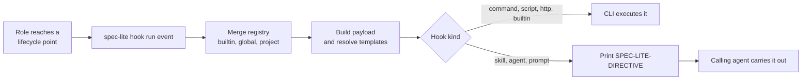

# Hooks

Hooks are spec-lite's general extension mechanism. Every core role announces its
lifecycle points as versioned **events** — `implement.pre`, `review.verdict`,
`fix.post`, and so on — and a hook is anything you subscribe to one of them.
What the hook does is entirely yours: run a linter, call a webhook, write a file,
or tell the calling agent to invoke another skill.

Changeset capture — the `changeset.json` that Review uses as its file scope — is
**not** the hook system. It is two ordinary hooks that happen to ship enabled by
default, written against the same public contract as anything you add, and you
can disable, replace, or ignore them without affecting any other hook.

- [Concepts](#concepts)
- [The two kinds of hook](#the-two-kinds-of-hook)
- [Add a hook](#add-a-hook)
- [Inspect hooks](#inspect-hooks)
- [Change or delete a hook](#change-or-delete-a-hook)
- [More examples](#more-examples)
- [Built-in hooks](#built-in-hooks)
- [Git workflow hooks](#git-workflow-hooks)
- [Hook definition reference](#hook-definition-reference)
- [Interpolation](#interpolation)
- [Event catalog](#event-catalog)
- [Failure handling and exit codes](#failure-handling-and-exit-codes)
- [Audit log](#audit-log)
- [Turning hooks off](#turning-hooks-off)
- [Troubleshooting](#troubleshooting)

## Concepts

| Term | Meaning |
|---|---|
| **Event** | A named lifecycle point, dotted and hierarchical (`implement.task.post`). A role reaches the point and runs `spec-lite hook run <event>`. |
| **Hook** | One entry in the registry that subscribes to one or more events and says what to do. |
| **Registry** | The merged set of hooks: builtins, then `~/.spec-lite/hooks.json`, then `.spec-lite/hooks.json`. |
| **Payload** | The JSON describing one event occurrence. Reachable from every hook through `${...}` templates, and delivered to `command`/`script` hooks on stdin and as `SPEC_LITE_*` environment variables. |
| **Directive** | The `SPEC-LITE-DIRECTIVE` line an agentic hook prints for the calling role to carry out. |


```mermaid
flowchart LR
  R["Role reaches a<br/>lifecycle point"] --> C["spec-lite hook run event"]
  C --> M["Merge registry<br/>builtin, global, project"]
  M --> P["Build payload<br/>and resolve templates"]
  P --> D{"Hook kind"}
  D -->|command, script, http, builtin| X["CLI executes it"]
  D -->|skill, agent, prompt| E["Print SPEC-LITE-DIRECTIVE"]
  E --> A["Calling agent carries it out"]
```

Hooks are dispatched in `order` (ascending, default `100`), ties broken by
declaration order. A hook subscribed to a wildcard such as `implement.*` fires on
every matching event; `*` matches one or more whole dotted segments.

## The two kinds of hook

| Kind | `type` | Who runs it | Guarantee |
|---|---|---|---|
| **Deterministic** | `command`, `script`, `http`, `builtin` | The CLI itself, with a timeout, an exit code, and a failure policy | Ran, or reported a failure |
| **Agentic** | `skill`, `agent`, `prompt` | Nobody — the CLI prints a `SPEC-LITE-DIRECTIVE` line and the calling agent acts on it | Best effort, by design |

The split is deliberate. Anything that must happen — a formatter, a webhook, a
guard that blocks the run — belongs in a deterministic kind. Anything that needs
judgement (*"review this deeply"*, *"record that decision in memory"*) belongs in
an agentic kind, where a model does the work and the CLI never pretends to
control the outcome.

## Add a hook

The worked example: **run the linter after each implementation, and stop the run
if it fails.**

### 1. Write the registry entry

Hooks live in `.spec-lite/hooks.json`. Create it if it does not exist:

```json
{
  "version": 1,
  "hooks": [
    {
      "name": "lint-after-implement",
      "description": "Run the linter after implementation; block on failure.",
      "events": ["implement.post"],
      "type": "command",
      "run": "npm run lint",
      "onFailure": "abort",
      "timeoutMs": 120000
    }
  ]
}
```

`name` is the identity of the hook — the merge key across registry layers, the
argument to `hook test`, and what appears in the audit log. `version` is the
registry format version and is always `1`.

> The file accepts only `version` and `hooks`; a `$schema` key is rejected. For
> editor autocomplete, point your editor at the published
> [`schema/hooks.schema.json`](../../schema/hooks.schema.json) instead.

### 2. Validate it

```bash
spec-lite hook validate
```

```text
Registry valid. 0 warning(s).
```

Validation is a static check with no side effects: JSON schema, event names, and
every `${...}` template against the variables its events guarantee. Run it in CI
so a broken registry fails the build rather than a delivery run.

### 3. Test it in isolation

`hook test` fires one hook against a synthetic payload without waiting for a role
to reach the real lifecycle point. It runs the actual executor — a `command` hook
really executes:

```bash
spec-lite hook test lint-after-implement --feature FEAT-012
```

```text
Testing "lint-after-implement" against event implement.post

  ✓ lint-after-implement (command) [ok]
```

### 4. Preview a whole event

`--dry-run` resolves every subscribed hook and prints what *would* run, with any
`${env:...}` value redacted:

```bash
spec-lite hook run implement.post --feature FEAT-012 --dry-run
```

`--feature` also accepts a preserved legacy Plan Feature ID such as
`FEAT-FP-007`. It resolves the same directory, spec, changeset, and audit-log
fields as a canonical `FEAT-###` ID; new features continue to use `FEAT-###`.

```text
  − capture-changeset (builtin) [skipped] — dry run — not executed
    builtin:capture-changeset
  − lint-after-implement (command) [skipped] — dry run — not executed
    npm run lint
```

### 5. Let it fire

Nothing else to wire up. The next time Implement finishes a feature it runs the
event itself, and the hook goes with it:

```text
  ✓ capture-changeset (builtin) [ok] — 2 file(s) in changeset (2 excluded)
  ✓ lint-after-implement (command) [ok]
```

## Inspect hooks

| Command | Answers |
|---|---|
| `spec-lite hook list` | Which hooks are active, which layer defined them, what they subscribe to |
| `spec-lite hook list --all` | Every resolved hook, including disabled hooks and their status |
| `spec-lite hook list --event implement.post` | Which hooks would fire for one specific event |
| `spec-lite hook events` | The full event catalog with `emitted`/`planned` status |
| `spec-lite hook vars` | Every `${...}` variable, its group, and an example value |
| `spec-lite hook validate` | Whether the merged registry is correct |
| `spec-lite hook test <name>` | What one hook actually does |

```bash
spec-lite hook list
```

```text
capture-baseline (builtin) — builtin — enabled
  events: implement.pre, implement.task.pre, fix.pre
  Records HEAD and pre-existing dirt so later diffs are scoped to this run.
capture-changeset (builtin) — builtin — enabled
  events: implement.post, implement.task.post, fix.post
  Diffs against the captured baseline and merges the result into changeset.json.
lint-after-implement (project) — command — enabled
  events: implement.post
  Run the linter after implementation; block on failure.
```

The parenthesised word is provenance: `builtin`, `global`
(`~/.spec-lite/hooks.json`), or `project` (`.spec-lite/hooks.json`). Later layers
replace earlier ones **by name**, wholesale — not a deep merge — so naming your
hook after a builtin replaces that builtin outright.

`hook list` shows only active hooks. Add `--all` to include hooks set to
`enabled: false`; they appear as disabled and remain excluded from dispatch.
Combine it with `--event` to inspect disabled subscriptions for one event.

## Change or delete a hook

| Goal | Do this |
|---|---|
| Delete a hook you added | Remove its object from `.spec-lite/hooks.json` |
| Keep it but stop it firing | `spec-lite hook disable <name>` |
| Enable a disabled hook | `spec-lite hook enable <name>` |
| Turn off a builtin | `spec-lite hook disable <name>` |
| Replace a builtin's behavior | Add an entry reusing the builtin's `name` with your own `type` and body |
| Change it for one repository only | Edit `.spec-lite/hooks.json`; it wins over the global file |
| Silence everything, everywhere | `"hooks": { "enabled": false }` in `.spec-lite.json` |

Toggle a hook by name without editing JSON:

```bash
spec-lite hook list --all
spec-lite hook disable capture-changeset
spec-lite hook enable capture-changeset
spec-lite hook disable capture-baseline --global
```

Both commands write to `.spec-lite/hooks.json` by default. `--global` writes to
`~/.spec-lite/hooks.json`, resolving only the builtin and global layers;
project overrides still take precedence. A project-only hook cannot be changed
with `--global`.

Each command stores the complete effective definition with the requested
`enabled` value, preserving events, executor settings, order, and failure policy.
This follows the existing whole-entry replacement rule. An inherited definition
copied into an override stays pinned there until you remove that override.
Unknown hook names and malformed registries exit `2` without writing. Enabling
also checks the hook's event names and templates before saving; neither command
executes the hook. The repository-wide `hooks.enabled: false` switch still wins
over any individual hook's state.

To add your own optional hook, include `"enabled": false` in its complete registry
entry. It is discoverable through `hook list --all`; opt in with `hook enable
<name>`, then preview the subscribed event with `hook run <event> --dry-run`.

Deleting the linter hook is exactly what it sounds like — drop the object, then
confirm it is gone:

```bash
spec-lite hook list --event implement.post
```

Turning off a shipped builtin without redefining it:

```json
{
  "version": 1,
  "hooks": [
    { "name": "capture-changeset", "events": ["implement.post"], "type": "builtin", "enabled": false }
  ]
}
```

After that, `spec-lite hook list` no longer shows `capture-changeset` and
`implement.post` dispatches only your own hooks. Review then has no
`changeset.json` for that feature and falls back to the spec's `Touched Files`
list — see [Built-in hooks](#built-in-hooks).

Replacing a builtin instead of disabling it — same name, different body:

```json
{
  "version": 1,
  "hooks": [
    {
      "name": "capture-changeset",
      "events": ["implement.post"],
      "type": "command",
      "run": "node scripts/my-changeset.mjs ${feature.dir}"
    }
  ]
}
```

## More examples

### Notify Slack when a review requests changes

Secrets never belong in a committed registry. `${env:NAME}` is the only channel
for them, and its value is redacted from `--dry-run` output and the audit log:

```json
{
  "name": "slack-review-verdict",
  "events": ["review.verdict"],
  "type": "http",
  "url": "${env:SLACK_WEBHOOK_URL}",
  "bodyTemplate": "{\"text\":\"Review verdict: ${verdict} — ${summary}\"}",
  "onFailure": "warn"
}
```

### Hand off to another skill automatically

An agentic hook does not run anything; it tells the calling agent what to do next:

```json
{
  "name": "review-after-implement",
  "events": ["implement.post"],
  "type": "skill",
  "skill": "spec-review",
  "args": "review feature ${feature.name}"
}
```

```text
  ✓ review-after-implement (skill) [emitted]
    SPEC-LITE-DIRECTIVE {"hook":"review-after-implement","type":"skill","event":"implement.post","skill":"spec-review","args":"review feature user_management"}
```

### Stamp every completed task into a log

Substituted values are escaped for wherever they land, so a feature name
containing a quote cannot break out of the command:

```json
{
  "name": "task-log",
  "events": ["implement.task.post"],
  "type": "command",
  "run": "echo ${timestamp} ${feature.id} ${task.id} >> .work-log",
  "order": 200
}
```

### Route hook failures somewhere visible

`hook.error` fires after any hook fails, with a `${summary}` naming the failures.
It never recurses into itself:

```json
{
  "name": "hook-failures-to-slack",
  "events": ["hook.error"],
  "type": "http",
  "url": "${env:SLACK_WEBHOOK_URL}",
  "bodyTemplate": "{\"text\":\"spec-lite hook failure: ${summary}\"}"
}
```

## Built-in hooks

Six builtins ship with the CLI. They are ordinary hooks, with the same registry,
fields, and failure policy as yours. Two capture changesets and are on by default.
One is an alternative capture strategy. Three run the
[Git workflow](#git-workflow-hooks) and stay off until you enable them.

| Name | Events | Enabled | Does |
|---|---|---|---|
| `capture-baseline` | `implement.pre`, `implement.task.pre`, `fix.pre` | yes | Records HEAD and whatever is already dirty, so pre-existing edits are never attributed to this run |
| `capture-changeset` | `implement.post`, `implement.task.post`, `fix.post` | yes | Diffs against that baseline and merges the result into the feature's `changeset.json` |
| `changeset-from-pr` | — | no (opt-in) | Uses `gh pr diff --name-only` instead of a local git baseline, for PR-first teams |
| `prepare-worktree` | `implement.pre`, `implement.task.pre`, `fix.pre` | no | Creates or resumes the work's worktree and branch |
| `commit-progress` | `implement.task.post`, `implement.post`, `fix.post` | no | Commits each task; commits the rest and pushes at completion |
| `create-pull-request` | `implement.post`, `fix.post` | no | Opens or reuses the work's pull request |

Builtin handlers run in-process as native TypeScript. They invoke Git or provider
CLIs when needed, without depending on `spec-lite` being on `PATH`.

### Shipped definitions

The capture builtins ship with these definitions. To change one, copy its entry
into `.spec-lite/hooks.json` and edit it. Your entry replaces the shipped one by
`name`, as a whole, so keep every property you don't mean to change. The Git
workflow builtins are listed under [Hook entries](#hook-entries).

<!-- builtin-hooks-json:start -->
```json
{
  "version": 1,
  "hooks": [
    {
      "name": "capture-baseline",
      "events": [
        "implement.pre",
        "implement.task.pre",
        "fix.pre"
      ],
      "type": "builtin",
      "builtin": "capture-baseline",
      "description": "Records HEAD and pre-existing dirt so later diffs are scoped to this run.",
      "enabled": true,
      "order": 10,
      "onFailure": "warn"
    },
    {
      "name": "capture-changeset",
      "events": [
        "implement.post",
        "implement.task.post",
        "fix.post"
      ],
      "type": "builtin",
      "builtin": "capture-changeset",
      "description": "Diffs against the captured baseline and merges the result into changeset.json.",
      "enabled": true,
      "order": 10,
      "onFailure": "warn"
    }
  ]
}
```
<!-- builtin-hooks-json:end -->

`changeset-from-pr` ships but subscribes to nothing until you opt in. Name it
through the `builtin` field and choose the events yourself:

```json
{
  "name": "changeset-from-pr",
  "events": ["implement.post"],
  "type": "builtin",
  "builtin": "changeset-from-pr"
}
```

It is an alternative capture strategy, not an addition: it merges into the same
`changeset.json`, so disable `capture-changeset` alongside it unless you really
want both sources unioned. It requires `gh` on `PATH` and an open pull request
for the current branch.

### What they produce

`.spec-lite/features/FEAT-###-<name>/changeset.json`:

```json
{
  "vcs": "git",
  "featureId": "FEAT-012",
  "baseline": {
    "sha": "bc8bd13cb251b7e397cda10b561d2ed7611859a9",
    "capturedAt": "2026-08-21T14:03:11.204Z",
    "dirtyAtBaseline": []
  },
  "files": [
    { "path": "src/auth/session.ts", "status": "M", "role": "implement" },
    { "path": "src/auth/expiry.ts", "status": "U", "role": "implement" }
  ],
  "excluded": [".spec-lite/features/FEAT-012-user_management/changeset.json"]
}
```

This is a **baseline-anchored diff, not git history**: it is scoped to exactly
the work done since the `*.pre` event, which is what a hand-maintained
`Touched Files` list was always trying to approximate. Review reads it as the
authoritative scope for `review feature` and `review plan`, falling back to a
spec's `Touched Files` section only for features created before hooks existed.

Generated output is filtered out automatically: `dist/`, `build/`, `out/`,
`node_modules/`, `package-lock.json`, `yarn.lock`, `pnpm-lock.yaml`, and
`.spec-lite/` itself.

Commit `changeset.json` with the work, because Review reads it. It records no
timestamps or HEAD, so its content changes only when the set of changed files
does. Capture times are in the [audit log](#audit-log), which stays local.

### When they do nothing

- **No `--feature`.** Capture is skipped with a note rather than failing — an
  ad-hoc Fix with no tracked feature is a normal case, not an error.
- **Not a git repository.** Capture is disabled and reported; Review falls back
  to the manual list.

To use hooks without changeset capture at all, disable both builtins as shown in
[Change or delete a hook](#change-or-delete-a-hook). Every other hook keeps
working.

## Git workflow hooks

Three opt-in builtins give each piece of work its own branch and pull request:

| Hook | Runs at | Does |
|---|---|---|
| `prepare-worktree` | `implement.pre`, `implement.task.pre`, `fix.pre` | Creates or resumes the work's worktree and branch |
| `commit-progress` | `implement.task.post`, `implement.post`, `fix.post` | Commits each finished task; at completion, commits the rest and pushes |
| `create-pull-request` | `implement.post`, `fix.post` | Opens the pull request, or reuses the existing one |

They cover Implement (every mode) and Fix. A run goes like this:

1. **Start.** A worktree is created at `.worktrees/<name>` on a new branch from
   `fromBranch`. The work's specs, plan, and settings are copied in, including
   uncommitted ones, and the agent works there from then on.
2. **Each task.** The worktree path is announced again before the task, and the
   task is committed after it.
3. **Completion.** Remaining changes are committed, the branch is pushed, and the
   pull request is opened.
4. **After you merge.** Run `spec-lite worktree cleanup <name>` in your main
   checkout, then pull.

### Requirements

- Git 2.36 or newer.
- Push access that never prompts: SSH, or HTTPS with a credential helper. Hooks
  run with `GIT_TERMINAL_PROMPT=0`.
- For pull requests, one of:
  - **GitHub:** `gh` on `PATH` and signed in (`gh auth status`).
  - **Azure DevOps:** `az` with `az extension add --name azure-devops`, signed in
    with `az login` or `AZURE_DEVOPS_EXT_PAT`.
  - **Anything else:** your own adapter. See [Custom PR provider](#custom-pr-provider).

### Set up

1. **Settings.** Add a `gitWorkflow` block to `.spec-lite.json`:

   ```json
   {
     "gitWorkflow": {
       "fromBranch": "develop",
       "pullRequest": { "provider": "github", "targetBranch": "develop" }
     }
   }
   ```

   To stop at a pushed branch with no pull request, leave out `pullRequest`.
   [Settings](#settings) lists every option.

2. **Hooks.** Enable the three hooks with the CLI:

   ```bash
   spec-lite hook enable prepare-worktree commit-progress create-pull-request
   ```

   Or add their entries to `.spec-lite/hooks.json` yourself; see
   [Hook entries](#hook-entries). Leave out `create-pull-request` if you left out
   `pullRequest`. `commit-progress` needs `prepare-worktree`, and
   `create-pull-request` needs `commit-progress`.

3. **Check.** Validate, then preview what the next feature will do:

   ```bash
   spec-lite hook validate
   spec-lite hook run implement.pre --feature FEAT-001 --dry-run
   ```

#### Settings

All Git workflow settings live in the `gitWorkflow` block of `.spec-lite.json`.
Every key is shown here:

```json
{
  "gitWorkflow": {
    "fromBranch": "develop",
    "fetch": true,
    "remote": "origin",
    "worktreeRoot": ".worktrees",
    "commitMessage": "feat(${id}): ${summary}",
    "pullRequest": {
      "provider": "github",
      "targetBranch": "develop"
    }
  }
}
```

| Setting | Default | Meaning |
|---|---|---|
| `fromBranch` | the main checkout's current branch | Branch new worktrees start from: local (`develop`) or remote-tracking (`origin/develop`). Set it; otherwise the start point depends on what is checked out, and `validate` warns. |
| `fetch` | `false` | Fetch `fromBranch` from `remote` first, and start from the remote's latest commit. Needs `fromBranch`. |
| `remote` | `origin` | Remote to push to |
| `worktreeRoot` | `.worktrees` | Folder for worktrees, relative to the main checkout |
| `commitMessage` | `FEAT-020 TASK-003: <summary>` | Commit subject template using `${id}` (feature ID, or the branch), `${task}`, `${summary}`, and `${branch}`. Write `${task:-final}` for a default. |
| `pullRequest.provider` | — | **Required for PRs.** `github`, `azure-devops`, or `command` |
| `pullRequest.targetBranch` | — | **Required for PRs.** Branch PRs merge into. It is never inferred. |
| `pullRequest.command`, `pullRequest.lookupCommand` | — | Custom provider only; see [Custom PR provider](#custom-pr-provider) |

Unknown keys are rejected by `hook validate`.

#### Hook entries

`hook enable` writes these entries to `.spec-lite/hooks.json`. Writing them by
hand has the same effect, and lets you adjust the properties marked as
changeable:

<!-- git-workflow-hooks-json:start -->
```json
{
  "version": 1,
  "hooks": [
    {
      "name": "prepare-worktree",
      "events": [
        "implement.pre",
        "implement.task.pre",
        "fix.pre"
      ],
      "type": "builtin",
      "builtin": "prepare-worktree",
      "description": "Create or resume the workflow's branch and worktree before code changes.",
      "enabled": true,
      "order": 0,
      "onFailure": "abort",
      "timeoutMs": 300000
    },
    {
      "name": "commit-progress",
      "events": [
        "implement.task.post",
        "implement.post",
        "fix.post"
      ],
      "type": "builtin",
      "builtin": "commit-progress",
      "description": "Commit verified tasks; commit and push completed implementations and fixes.",
      "enabled": true,
      "order": 200,
      "onFailure": "abort",
      "timeoutMs": 120000
    },
    {
      "name": "create-pull-request",
      "events": [
        "implement.post",
        "fix.post"
      ],
      "type": "builtin",
      "builtin": "create-pull-request",
      "description": "Create or reuse the workflow's PR against the configured target branch.",
      "enabled": true,
      "order": 300,
      "onFailure": "abort",
      "timeoutMs": 120000
    }
  ]
}
```
<!-- git-workflow-hooks-json:end -->

| Property | Can you change it? |
|---|---|
| `name` | No. Keep it, so your entry replaces the shipped definition. |
| `type`, `builtin` | No. They select the built-in handler. |
| `events` | No. Validation rejects an entry missing any of the events shown. |
| `enabled` | Yes. `false` turns the hook off. Leaving `prepare-worktree` off while `commit-progress` is on fails validation, and so does leaving `commit-progress` off while `create-pull-request` is on. |
| `order` | Within limits. `prepare-worktree` must run first on its events. `commit-progress` must run after `capture-changeset` (order `10`), and `create-pull-request` after `commit-progress`. Give your own checks, such as lint or tests, an order between `10` and `200` so they run before the commit. |
| `onFailure` | No. Validation requires `"abort"`, so a failed step stops the run. |
| `timeoutMs` | Yes. This is the budget for each Git or provider command the hook runs: creating the worktree, a commit or push, or a PR call. |
| `description` | Yes. It's shown by `hook list`. |

Hook entries take no settings: there is no `options` property. Settings go in
`.spec-lite.json`, as shown in [Settings](#settings).

### Branches and worktrees

| Work | Started by | Branch | Worktree |
|---|---|---|---|
| One feature | Implement | `ft/feat-020-execute-operations` | `.worktrees/feat-020-execute-operations` |
| A whole plan | Implement, Plan Mode | `plan/orders` (from `plan_orders.md`) | `.worktrees/plan-orders` |
| A fix | Fix | `fix/auth-issue` | `.worktrees/fix-auth-issue` |
| Review findings | Implement, Review Mode | `review/checkout` (from `review_checkout.md`) | `.worktrees/review-checkout` |
| A YOLO run | YOLO | `yolo/20261006-store` | `.worktrees/yolo-20261006-store` |

- **Names are stable.** They come from the feature directory, the plan file, the
  review report, or the YOLO Run ID, so a retry or a resumed session gets the same
  branch. A fix uses the name the agent passes: your ticket ID when you give one.
- **A plan or YOLO run is one branch.** Each feature builds on the previous ones,
  and the pull request opens when the whole run completes. A feature implemented
  on its own gets its own branch.
- **Follow-up work joins its feature.** A fix or review remediation for a feature
  whose worktree still exists goes onto that branch and updates its pull request.
- **Name format.** Names use lowercase letters, digits, and hyphens. Names longer
  than 60 characters end in a short hash.

### After merging

```bash
spec-lite worktree list
spec-lite worktree cleanup feat-020-execute-operations   # or --merged for all
git pull
```

Run cleanup from the main checkout, before pulling. It first checks that the
branch is merged into `targetBranch` (or `fromBranch`). For a squash merge, it
asks the PR provider whether that exact commit merged. If the branch isn't
merged, cleanup removes nothing. Otherwise it:

1. Removes the worktree. This is never forced; Git refuses if there are
   uncommitted changes.
2. Deletes the local branch. Remote branches are left to your Git host.
3. Resets specs copied from your main checkout while they were uncommitted, so
   your identical local copies don't block `git pull`. Files you've changed since
   are kept.
4. Forgets the workflow. Starting the same work again creates a fresh branch from
   the current `fromBranch`.

### What the hooks guarantee

- **No duplicates.** Retrying any step reuses the same worktree, branch, and pull
  request. There are no empty commits and no force-pushes.
- **Each task is committed with its `changeset.json`.** Its content changes only
  when the changed files do, so a retry commits nothing.
- **Hook logs are never committed.** spec-lite adds `.spec-lite/**/hooks.log.jsonl`
  and the worktree folder to `.git/info/exclude`, and edits no tracked file. A log
  committed by an earlier version stays tracked until you `git rm --cached` it.
- **Failures stop the run.** Each hook uses `onFailure: "abort"`. Your own hooks
  ordered before `200`, such as lint or tests, run before the commit.
- **Work in the wrong checkout is caught.** Committing outside a managed worktree
  is refused, and a completion with no changes outside `.spec-lite/` fails instead
  of pushing.
- **New work never goes silently onto a merged PR.** If the branch's PR is merged
  or closed and the branch has new commits, the PR step fails.
- **Interrupted runs recover.** A rerun finishes an interrupted setup, and a lock
  left by a killed process is taken over once that process has exited.

### Limitations

- **Tools scan the worktree folder.** `.worktrees/` is inside your checkout, and
  test runners and compilers ignore `.gitignore`. Exclude it from them, for
  example vitest `exclude: ["**/.worktrees/**"]`, jest `testPathIgnorePatterns`,
  tsconfig `exclude`, or ESLint `ignores`. Alternatively, point `worktreeRoot`
  outside the checkout, if your agent is allowed to write there.
- **Dependencies aren't installed.** A new worktree has no `node_modules` and none
  of your git-ignored files, such as `.env`. A `command` hook on `implement.pre`
  and `fix.pre` with `order: 5` runs inside the new worktree and can install them.
- **Only Implement and Fix are covered.** Document, test-writing, and DevOps roles
  edit whichever checkout they run in.
- **Completions can be slow.** Pushing and opening a PR can take minutes. Give your
  agent's command timeout at least 5 minutes for `implement.post` and `fix.post`.
- **One set of branches per repository.** All workflows use the same `remote`,
  `fromBranch`, and `targetBranch`.

### Skipping for one run

```bash
spec-lite hook run implement.pre --feature FEAT-020 --skip prepare-worktree
```

Repeat `--skip`, pass `--skip '*'` for every hook, or set
`SPEC_LITE_SKIP_HOOKS=prepare-worktree,commit-progress` for a process and its
children. The registry is not changed. Skipping one hook doesn't skip validation
of the others. YOLO runs the hooks like any other role.

### Custom PR provider

Set `pullRequest.provider` to `command`, and give both commands as literal
executable/argument arrays. No shell is involved:

```json
{
  "gitWorkflow": {
    "fromBranch": "develop",
    "pullRequest": {
      "provider": "command",
      "targetBranch": "develop",
      "command": ["node", "scripts/pr-adapter.cjs", "create"],
      "lookupCommand": ["node", "scripts/pr-adapter.cjs", "lookup"]
    }
  }
}
```

**Inputs.** Both commands receive `SPEC_LITE_PR_HEAD`, `SPEC_LITE_PR_BASE`,
`SPEC_LITE_PR_TITLE`, `SPEC_LITE_PR_BODY_FILE`, `SPEC_LITE_PR_REMOTE`, and
`SPEC_LITE_PR_REMOTE_URL`. Pull request text only ever arrives this way, never as
arguments. In a `.cmd` adapter, don't expand `%SPEC_LITE_PR_TITLE%` unquoted; a
Node or Python adapter avoids cmd.exe parsing altogether.

**Lookup output.** Print JSON `null` when there is no PR, or an object (or an
array of objects) for matching PRs, including closed and merged ones:
- `url` — required.
- `state` — `open`, `closed`, or `merged`. Without it, the PR is treated as open.
- `headSha` — the PR's source commit. Cleanup needs it to confirm a squash merge.

Fail with a non-zero exit on API or authentication errors; never print `null` for
a failed lookup.

**Create output.** Print `{"url": "https://..."}`.

The commands inherit the process environment for credentials. Keep secrets out of
the registry and out of command output.

### How it works

- **Handoff.** A subprocess can't change its caller's directory. So
  `prepare-worktree` prints `SPEC-LITE-WORKTREE {"path": …, "branch": …}` (or
  `payload.worktree` with `--json`), and Implement and Fix move to that path. The
  remaining hooks of the same event already run there.
- **Choosing the workflow.** The CLI checks these in order:
  1. Already inside a managed worktree: continue in it.
  2. `--payload plan=<file>` or `--payload yolo=<Run ID>` given: use that workflow.
  3. `--feature` given: use the open workflow that owns the feature. That is
     either its own, or a plan or YOLO workflow whose plans list it.
  4. Otherwise: create or resume the feature, fix (`fix.pre --payload name=…`), or
     review (`implement.pre --payload name=…`) workflow.
- **State.** Workflow state and locks live in `.git/spec-lite/`, outside every
  commit.
- **Manual calls.** The skills make these calls themselves. By hand they look like:

  ```bash
  spec-lite hook run implement.pre --feature FEAT-020
  spec-lite hook run implement.pre --payload plan=.spec-lite/plan_orders.md
  spec-lite hook run fix.pre --payload name=auth-issue
  ```

### Git workflow troubleshooting

| Message | What to do |
|---|---|
| `Another spec-lite hook is using this workflow` | Wait for the other run. If no spec-lite process is running, delete the lock file the message names. |
| `… has no worktree, but branch … still exists` | If it was merged: `spec-lite worktree cleanup <name>`. If not: `git worktree add <path> <branch>` resumes it. |
| `Branch … already exists outside this workflow` | Rename or delete that branch. |
| `… has no changes outside .spec-lite` | The edits landed in another checkout. Move them into the worktree and rerun. |
| `Pull request … is merged, and the branch has commits it does not contain` | Reopen the PR, or move those commits to a new workflow. |
| `Cannot continue here: this worktree belongs to …` | Run that work from the main checkout. |
| Push rejected | Someone else pushed to the branch. Pull in the worktree and rerun. |
| Tests run twice in the main checkout | Exclude the worktree folder; see [Limitations](#limitations). |

## Hook definition reference

| Field | Applies to | Default | Meaning |
|---|---|---|---|
| `name` | all | — | **Required.** Unique identity and merge key across registry layers |
| `events` | all | — | **Required.** Event names or wildcard patterns (`implement.*`) |
| `type` | all | — | **Required.** `command`, `script`, `http`, `builtin`, `skill`, `agent`, `prompt` |
| `description` | all | — | Human-readable note, shown by `hook list` |
| `enabled` | all | `true` | `false` excludes the hook from dispatch and the default listing; `hook list --all` includes it |
| `order` | all | `100` | Lower runs first; ties broken by declaration order |
| `timeoutMs` | deterministic | `30000` | Wall-clock budget before the hook is killed and reported as failed |
| `onFailure` | all | `warn` | `warn` (log and continue), `abort` (stop the chain, exit 1), `ignore` (silent) |
| `once` | all | `false` | Skip if this hook already succeeded for this event on this feature |
| `payloadSchema` | all | — | JSON Schema checked against the payload *before* invocation |
| `builtin` | `builtin` | the hook's `name` | Handler id in the builtin registry |
| `run` | `command`, `script` | — | Command line or script path. Interpolated |
| `shell` | `command`, `script` | `auto` | `auto` (sh on POSIX, PowerShell on Windows), `bash`, `pwsh` |
| `cwd` | `command`, `script` | workspace root | Working directory, relative to the workspace root. Interpolated |
| `env` | `command`, `script` | — | Extra environment variables. Values are interpolated |
| `url` | `http` | — | Target URL. Interpolated and percent-encoded |
| `method` | `http` | `POST` | HTTP method |
| `headers` | `http` | `Content-Type: application/json` | Extra request headers. Values are interpolated and stripped of newlines |
| `bodyTemplate` | `http` | full payload JSON | Request body. Interpolated and JSON-escaped |
| `skill` / `agent` | `skill`, `agent` | — | Name carried in the emitted directive |
| `prompt` | `prompt` | — | Literal instruction carried in the directive. Interpolated |
| `args` | `skill`, `agent` | — | Arguments carried in the directive. Interpolated |

`command` and `script` behave identically; the distinction records intent — a
`script` hook usually names a checked-in file, a `command` hook is a one-liner.
`cmd.exe` is deliberately unsupported: its quoting rules cannot be applied safely,
and safe interpolation depends on correct quoting.

`command` and `script` hooks also receive the payload on **stdin** and through
these environment variables, which is often easier than templating:
`SPEC_LITE_EVENT`, `SPEC_LITE_FEATURE_ID`, `SPEC_LITE_FEATURE_DIR`,
`SPEC_LITE_CHANGED_FILES`, and `SPEC_LITE_PAYLOAD_FILE`.

## Interpolation

`${...}` templates in `run`, `cwd`, `env`, `url`, `headers`, `bodyTemplate`,
`args`, and `prompt` are resolved in a **single pass** — a substituted value is
never re-scanned, so payload text cannot inject further references — then escaped
for its destination:

| Field | Escaping |
|---|---|
| `run` | Shell-quoted, so a value always lands as exactly one argument |
| `url` | Percent-encoded |
| `bodyTemplate` | JSON-escaped, so the body stays parseable |
| `headers` | Newlines collapsed to a space and control characters dropped, so a value cannot inject a second header |
| `cwd`, `env`, `args`, `prompt` | Raw — no shell or wire format is involved |

Resolution **fails closed**. A reference with no value is an error that stops the
hook before it runs; it never becomes an empty string. Write `${task.id:-none}`
wherever a value may legitimately be absent.

```text
${name}                 a table variable
${name:-default}        with a fallback when it has no value
${env:NAME}             a process environment variable
${env:NAME:-default}    with a fallback
$${                     a literal "${"
```

Each event declares which variable **groups** it guarantees, so
`spec-lite hook validate` rejects `${task.id}` on `implement.post` in CI rather
than at fire time:

```text
[error] bad-var: ${task.id} has no guaranteed value on review.post.
        Subscribe to an event that provides "task", or write ${task.id:-default}.
```

`${env:NAME}` reads only the real process environment and is redacted from
`--dry-run` output and `hooks.log.jsonl`. It is the only place a secret belongs —
an `Authorization` header is written as `"Bearer ${env:API_TOKEN}"`, never as the
token itself.

<!-- hook-vars-table:start -->
| Variable | Group | Meaning | Example |
|---|---|---|---|
| `${event}` | base — every event | Full dotted event name. | `implement.post` |
| `${role}` | base — every event | Agent or skill that emitted the event. | `implement` |
| `${phase}` | base — every event | Lifecycle position: pre, post, or signal. | `post` |
| `${runId}` | base — every event | Stable id for one `hook run` invocation. | `01J9F2K7M4` |
| `${timestamp}` | base — every event | ISO-8601 UTC timestamp of the run. | `2026-08-21T14:03:11.204Z` |
| `${cwd}` | base — every event | Absolute workspace root. | `/repo` |
| `${provider}` | base — every event | Configured harness alias, or "unknown". | `claude-code` |
| `${payload}` | base — every event | The entire payload as compact JSON. | `{"event":"implement.post",…}` |
| `${payload.file}` | base — every event | Path to a temp file holding the payload JSON. | `/tmp/spec-lite-x.json` |
| `${feature.id}` | feature | Stable feature identifier. | `FEAT-012` |
| `${feature.name}` | feature | Snake_case feature name. | `user_management` |
| `${feature.dir}` | feature | Feature directory, workspace-relative. | `.spec-lite/features/FEAT-012-user_management` |
| `${feature.spec}` | feature | Feature spec path, workspace-relative. | `.spec-lite/features/FEAT-012-user_management/spec.md` |
| `${task.id}` | task | Task identifier within a feature. | `TASK-003` |
| `${changes.count}` | changes | Number of files in the captured changeset. | `12` |
| `${changes.source}` | changes | How the changeset was captured: git, gh, or none. | `git` |
| `${changes.baseline}` | changes | Baseline commit the changeset is diffed against. | `abc1234` |
| `${changes.head}` | changes | HEAD of the checkout when the event fired. | `def5678` |
| `${changes.files}` | changes | Changed paths, newline-separated. | `src/a.ts\nsrc/b.ts` |
| `${verdict}` | verdict | Review verdict. | `Request changes` |
| `${summary}` | summary | One-line summary supplied by the emitting role. | `Added session expiry handling` |
| `${env:NAME}` | environment | A process environment variable — the only channel for secrets. | `${env:SLACK_WEBHOOK_URL}` |
<!-- hook-vars-table:end -->

`${provider}` reads `provider` (then the first entry of `providers`) from
`.spec-lite.json`, and resolves to `unknown` when neither is configured — so it
never needs a `:-default`.

## Event catalog

Only the core pipeline is wired today. Events marked `planned` are declared so
that subscribing to them validates with a warning rather than an unknown-event
error; they begin firing in a later release.

<!-- hook-events-table:start -->
| Event | Role | Status | Guarantees |
|---|---|---|---|
| `brainstorm.pre` | brainstorm | emitted | — |
| `brainstorm.post` | brainstorm | emitted | `summary` |
| `plan.pre` | plan | emitted | — |
| `plan.post` | plan | emitted | `summary` |
| `plan-feature.pre` | plan-feature | emitted | — |
| `plan-feature.post` | plan-feature | emitted | `feature`, `summary` |
| `architect.pre` | architect | planned | — |
| `architect.post` | architect | planned | `summary` |
| `plan-critic.pre` | plan-critic | planned | — |
| `plan-critic.post` | plan-critic | planned | `summary` |
| `build-data-model.pre` | build-data-model | planned | — |
| `build-data-model.post` | build-data-model | planned | `summary` |
| `feature.pre` | feature | emitted | — |
| `feature.post` | feature | emitted | `summary` |
| `feature.spec.post` | feature | emitted | `feature`, `summary` |
| `implement.pre` | implement | emitted | `feature` |
| `implement.post` | implement | emitted | `feature`, `changes`, `summary` |
| `implement.task.pre` | implement | emitted | `feature`, `task` |
| `implement.task.post` | implement | emitted | `feature`, `task`, `changes` |
| `implement.feature.post` | implement | emitted | `feature`, `changes`, `summary` |
| `review.pre` | review | emitted | — |
| `review.post` | review | emitted | `summary` |
| `review.verdict` | review | emitted | `verdict`, `summary` |
| `fix.pre` | fix | emitted | — |
| `fix.post` | fix | emitted | `changes`, `summary` |
| `write-unit-tests.pre` | write-unit-tests | planned | — |
| `write-unit-tests.post` | write-unit-tests | planned | `summary` |
| `write-integration-tests.pre` | write-integration-tests | planned | — |
| `write-integration-tests.post` | write-integration-tests | planned | `summary` |
| `document.pre` | document | planned | — |
| `document.post` | document | planned | `summary` |
| `document-design.post` | document-design | planned | `summary` |
| `document-feature.post` | document-feature | planned | `feature`, `summary` |
| `document-usage.post` | document-usage | planned | `summary` |
| `document-readme.post` | document-readme | planned | `summary` |
| `devops.pre` | devops | planned | — |
| `devops.post` | devops | planned | `changes`, `summary` |
| `memorize.post` | memorize | planned | `summary` |
| `todo.post` | todo | planned | `summary` |
| `tool-help.post` | tool-help | planned | `summary` |
| `yolo.pre` | yolo | planned | — |
| `yolo.post` | yolo | planned | `summary` |
| `yolo.phase.post` | yolo | planned | `summary` |
| `hook.error` | * | emitted | `summary` |
<!-- hook-events-table:end -->

Guarantee groups are what `validate` checks templates against. A group absent
from an event may still be present at runtime — a Fix often does map to a feature
— but a template relying on it must supply a `${name:-default}`.

## Failure handling and exit codes

`spec-lite hook run` exits:

| Code | When | Effect on the calling role |
|---|---|---|
| `0` | Every hook succeeded, or a failure was policied `warn`/`ignore` | Continue |
| `1` | A hook with `onFailure: "abort"` failed | Stop and report |
| `2` | A **contract error** | Stop and fix the configuration |

A contract error means the event could not be dispatched as specified: the event
name is not in the catalog, the registry failed validation, a `${...}` reference
had no value, or the payload failed a hook's `payloadSchema`. Contract errors
bypass `onFailure` entirely and stop the chain *before* anything with side
effects runs — a misconfigured registry is a stop-and-fix situation, not a
runtime hiccup.

```text
  ✗ needs-summary (command) [failed] — ${summary} has no value on event "fix.post".
    Write ${summary:-default} to allow it to be absent.
exit 2
```

An event name outside the catalog exits `2` without dispatching anything, so a
typo in a role or a script is loud rather than silently skipping every hook the
intended event would have run. Firing a *catalog* event that nothing subscribes
to is a normal no-op with exit `0`.

The repository kill switch still wins: with `hooks.enabled: false`, even an
unknown event reports that hooks are disabled and exits `0`.

Reentrancy is capped. A hook that invokes spec-lite, which fires another event, is
tracked through `SPEC_LITE_HOOK_DEPTH` and `SPEC_LITE_HOOK_CHAIN`; the chain
aborts at depth 3, and the same hook cannot fire twice within one chain.

## Audit log

Every dispatch for a feature is appended to
`.spec-lite/features/FEAT-###-<name>/hooks.log.jsonl`, one JSON object per line:

```json
{"at":"2026-08-21T14:03:11.445Z","name":"capture-baseline","event":"implement.pre","kind":"builtin","status":"ok","durationMs":165,"message":"baseline bc8bd13 captured (0 pre-dirty)"}
```

This is also what `once: true` reads to decide whether a hook has already run.
The log is local: the first time a clone writes one, spec-lite adds
`.spec-lite/**/hooks.log.jsonl` to `.git/info/exclude`, so it is never committed.
To make that rule visible to your team, add the same line to `.gitignore`.

## Turning hooks off

To silence every hook for a whole clone — CI, a fork, a bisect run — without
editing the registry, set `hooks.enabled` to `false` in `.spec-lite.json`:

```json
{ "hooks": { "enabled": false } }
```

Every `hook run` then reports that hooks are disabled and dispatches nothing.

## Troubleshooting

| Symptom | Cause | Fix |
|---|---|---|
| Hook never fires | Not subscribed to the event you think | `spec-lite hook list --event <name>` |
| Nothing happens, exit `0` | No hook subscribes to that event | `spec-lite hook list --event <name>` |
| `unknown event`, exit `2` | The event name is not in the catalog | `spec-lite hook events` to check the spelling |
| Exit `2` before anything ran | Registry error, or a `${...}` with no value | `spec-lite hook validate` |
| `${env:X}` warning at validate time | Variable not set in the current shell | Export it wherever hooks run, or add `:-default` |
| Builtin still active after disabling | Entry name does not match the builtin exactly | Reuse the exact name (`capture-changeset`); `list --all` intentionally still shows disabled hooks |
| Changeset empty | No `--feature`, no baseline, or not a git repository | Check the `capture-baseline` line in `hooks.log.jsonl` |
| Agentic hook ignored | Directives are best-effort by design | Use a deterministic kind if it must happen |

## Related

- [CLI reference](../usage.md#hook) — every `spec-lite hook` command and option
- [Review](review.md) — how `changeset.json` becomes review scope
- [Architecture](../architecture.md) — where hooks sit in the overall design
