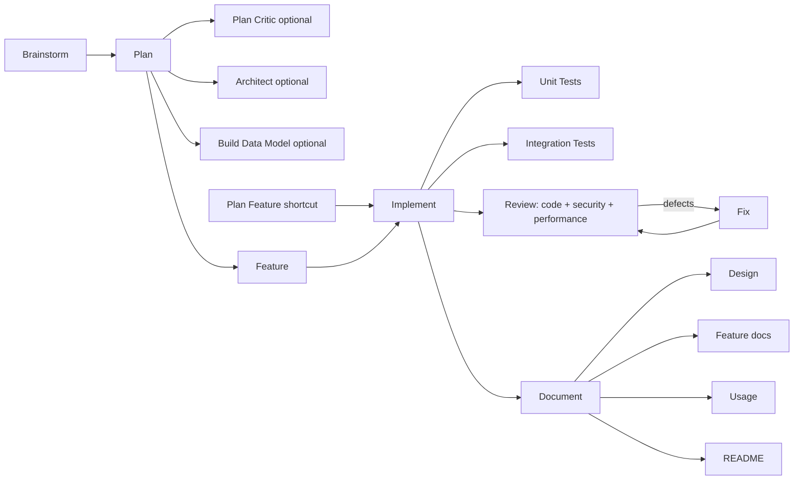

# Orchestrator — Pipeline Reference

This is the agent-facing source of truth for how spec-lite roles cooperate. Individual prompts own their detailed process; this reference owns cross-cutting contracts.

## Pipeline



**Memorize**, **TODO**, **Tool Helper**, **Help**, and **YOLO** are cross-cutting. YOLO orchestrates the pipeline; it does not replace specialist instructions.

## Artifact Ownership

| Artifact / field | Writer | Readers / contract |
|---|---|---|
| `.spec-lite/memory.md` | Memorize; core roles following Memory Capture | All relevant roles treat entries as hard requirements; only Memorize reorganizes |
| `.spec-lite/plan*.md` content and IDs | Plan; Feature may back-fill legacy ID rows | Downstream roles; user edits win |
| Plan `Spec File` | Feature | Implement and Review resolve specs from it |
| Plan `Status` | Implement only | Feature/Review/Document read only |
| Feature spec content | Feature or Plan Feature | Implement executes it |
| Feature `State Tracking` | Implement only | Review confirms every task is complete before using the feature as a scope |
| Feature `changeset.json` / `hooks.log.jsonl` | The `capture-baseline`/`capture-changeset` hooks, fired by Implement and Fix at `*.pre`/`*.post` | Review uses `changeset.json` as the deterministic scope; a hand-maintained `## Touched Files` list in the spec is the legacy fallback only when `changeset.json` is absent |
| `.spec-lite/data_model.md` | Build Data Model | Feature/Implement/Review treat it as authoritative schema |
| `.spec-lite/feature-summary.md` | Implement and Fix | AI-facing current behavior; headings retain `FEAT-###` |
| `.spec-lite/reviews/review_<scope>.md` | Review; Fix/Implement may add resolution notes | Review recommends; Fix/Implement remediate |
| `.spec-lite/TODO.md` | TODO plus roles tracking out-of-scope work | Backlog only, never implicit current scope |
| `README.md`, configured docs | Document writer family | Human-facing current state |
| `.spec-lite/yolo_state.md` | YOLO | Resume source of truth |

## Precedence and Conflicts

1. Current user instruction and user-authored artifact edits.
2. `.spec-lite/memory.md` standing rules.
3. Explicit, justified plan-specific overrides for that plan.
4. Authoritative data model and completed feature specs.
5. Evidence from current code/tests/tools.
6. Prompt defaults.

Never silently reinterpret a conflict. Surface the exact competing rules and the smallest decision needed. Review findings do not rewrite plans or code; bugs, vulnerabilities, and bottlenecks route to **Fix**, while missing product behavior routes to **Feature**.

## Context and Isolation

- Read only artifacts required by the active role and user request; user modifications are intentional.
- Feature and implementation Plan Modes use a fresh subagent per feature, sequentially. Precompute legacy feature IDs before fan-out; serialize writes to shared plans/docs.
- Conversation history is not an artifact. Re-read memory, plan, spec, and current code for each isolated feature.
- If a mandatory artifact is missing, stop and name the producer that must create it. Do not invent or silently skip it.
- If multiple plan files exist in `.spec-lite/`, ask the user which plan applies.

## Deterministic Feature IDs

Use one repository-wide `FEAT-###` sequence. IDs are immutable, never reused, and remain gapped after deletion.

1. Scan the `ID` column of the High-Level Features table in **every** plan file (`.spec-lite/plan*.md`).
2. Scan `.spec-lite/features/` for `FEAT-###-<name>` directories and legacy `FEAT-FP-###-<name>` directories; read the highest numeric suffix across both formats — the ID is in the path itself, so this is a directory listing, not a content grep. Preserve existing `FEAT-FP-###` IDs, but never allocate a new one.
3. Next ID = highest number found + 1; if none found, `FEAT-001`.

Plan assigns IDs for plan rows; Plan Feature assigns one standalone ID; Feature copies the plan ID and only allocates/back-fills legacy rows. Implement, Review, and Document Feature are read-only consumers.

## Review Protocol

Review accepts exactly one deterministic scope:

- `review files <paths/globs>`: exact existing matches; reject none.
- `review feature <name>`: the feature's `changeset.json` (Touched Files fallback if absent); reject incomplete/empty scope.
- `review plan [file]`: union of completed features' `changeset.json` (Touched Files fallback per feature); list skipped incomplete rows and reject when none are complete.

Every run covers code correctness/testing, security, and performance; uses `REV-###`; and writes `.spec-lite/reviews/review_<scope>.md` with Critical/High/Medium/Low severity and one verdict.

## Documentation Protocol

`.spec-lite.json` contains:

```json
{
  "documentation": {
    "directory": "docs",
    "level": "technical",
    "updateWithDevelopment": true
  }
}
```

- `technical`: `README.md` plus `<docs-dir>/architecture.md`.
- `full`: technical set plus `quickstart.md`, `usage.md`, and one `features/<feature>.md` per implemented feature.
- Document full/update/targeted mode delegates Design → Feature writers → Usage → README sequentially.
- Mermaid is required for architecture/design. Commands/examples are verified. Missing license/contribution facts are asked, never invented.
- Implement/Fix invoke Document update when `updateWithDevelopment` is true; otherwise they suggest it.
- Legacy `docs/explore/` is input material for the first full run, not a continuing output.

## Memory Protocol

Memory is the authoritative project-wide instruction set. The [Memorize skill](../skills/memorize/SKILL.md#memory-capture-protocol) owns taxonomy, conflict resolution, deduplication, bootstrap, and restructuring.

At task end, Implement, Fix, Feature, Plan, Plan Feature, Review, Brainstorm, and Architect may auto-capture at most three durable user rules or multiply-verified codebase conventions. They append only non-conflicting entries with `*(auto-captured YYYY-MM-DD)*`, report captures, and leave conflicts unchanged for user resolution.

## Hook Protocol

`spec-lite` dispatches a versioned event catalog (`spec-lite hook events`) at fixed lifecycle points in **Brainstorm, Plan, Plan Feature, Feature, Implement, Review, and Fix** — the v1-wired roles. Every other role's events are declared in the catalog but not yet emitted; a hook registered against one of those validates with a warning, not an error.

Two hook classes:

- **Deterministic** (`command`, `script`, `http`, `builtin`) — run by the CLI itself, in-process, with exit codes and a per-hook failure policy (`onFailure: warn` by default; `abort` stops the calling role and must be reported, not silently continued past).
- **Agentic** (`skill`, `agent`, `prompt`) — never executed by the CLI. `hook run` prints a `SPEC-LITE-DIRECTIVE` line naming what to invoke; the calling role carries it out and is therefore the only guarantee of delivery.

The registry (`.spec-lite/hooks.json`, plus `~/.spec-lite/hooks.json` globally) merges builtins → global → project by `name`, replacing an entire entry rather than deep-merging — a project hook can override a builtin outright by reusing its name, or disable it with `enabled: false`. `spec-lite hook validate` checks the merged registry, including every `${...}` interpolation against `spec-lite hook vars`, before any hook runs.

`hook run` exit codes are part of the contract: **0** all hooks succeeded, **1** a hook with `onFailure: "abort"` failed (stop and report), **2** a *contract* error — unknown event, unresolvable `${...}`, or a payload failing a hook's `payloadSchema`. Exit 2 means nothing with side effects ran; report it rather than retrying. Subscribe a hook to `hook.error` to route failures somewhere visible.

The shipped `capture-baseline`/`capture-changeset` builtins are what make `changeset.json` (see Artifact Ownership) authoritative: `*.pre` snapshots HEAD and anything already dirty so pre-existing edits are never misattributed, and `*.post` diffs against that baseline, subtracting only what is still unchanged since it — not everything that was ever dirty. This is a baseline-anchored diff, never raw git history.

## Canonical Prompt Style

Prompt edits may remove duplication, restatement, and unnecessary prose, but must preserve every input, exact artifact path, process step, ownership rule, handoff, condition, ambiguity-resolving example, and output template. Keep shared wording verbatim so safety-net tests detect drift.

### Project Tools

If `.spec-lite/tools/` exists, list it, read each script's header comment, and run relevant tools to gather live context before and during work. Never modify those tools; use the **Tool Helper** skill for changes.

### Memory Context

Hard requirement:

```markdown
- **`.spec-lite/memory.md`** (if present) — authoritative coding, architecture, testing, logging, and security instructions; treat every entry as a hard requirement.
```

Soft context:

```markdown
- **`.spec-lite/memory.md`** (if present) — read for relevant standing project guidance.
```

Multi-plan rule: `If multiple plan files exist in .spec-lite/, ask the user which plan applies.`

### Enhancement Tracking

Do not expand the current scope. Append out-of-scope improvements to `.spec-lite/TODO.md` as `- [ ] <description> (discovered during: <context>)`, then notify the user.

## Naming and Structure

```text
.spec-lite/
├── memory.md
├── plan.md / plan_<name>.md
├── data_model.md
├── feature-summary.md
├── TODO.md
├── yolo_state.md
├── features/
│   ├── FEAT-###-<name>/
│   │   ├── spec.md
│   │   ├── changeset.json
│   │   └── hooks.log.jsonl
│   ├── unit_tests_<name>.md
│   └── integration_tests_<name>.md
├── reviews/
│   ├── plan_critique_<scope>.md
│   ├── review_<scope>.md
│   └── fix_<issue>.md
├── devops/
└── stacks/
```

Use snake_case artifact names, `FEAT-###`, `TASK-###`, and `REV-###`. Standardize `feature-summary.md` (hyphen). Generated artifacts include `<!-- Generated by spec-lite | <role>: <name> | date: <date> -->`.

## Project Tools

If `.spec-lite/tools/` exists, list it, read each script's header comment, and run relevant tools to gather live context before and during work. Never modify those tools; use the **Tool Helper** skill for changes.

## Enhancement Tracking

Do not expand the current scope. Append out-of-scope improvements to `.spec-lite/TODO.md` as `- [ ] <description> (discovered during: <context>)`, then notify the user.

## What's Next? — Completion Handoff

End completed work with only relevant, copy-pasteable natural-language actions using actual artifact names:

```markdown
> **What's next?** {{brief completion context}}
>
> 1. **{{Action}}**: *"{{specific request}}"*
> 2. **{{Action}}**: *"{{specific request}}"*
```

Do not suggest already-completed work. Prefer the next pipeline dependency, then optional validation/hardening/documentation.

Use [Help](help.md) for the user-facing catalog and workflow chooser.
